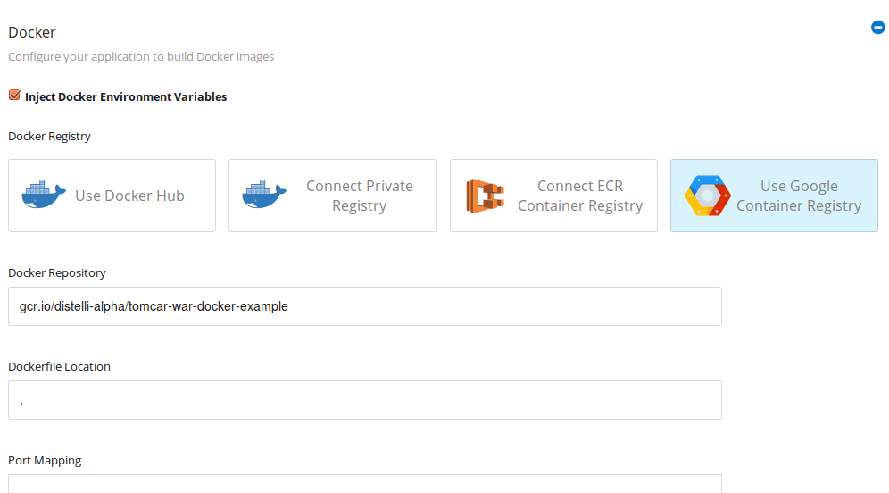

Integrating your Pipelines account with Google Compute Container Registry provides the necessary credentials for you to successfully build and deploy Docker images/containers with Pipelines.

> **Note:** The following credential configuration can be completed when **Enabling Docker for new Applications**, **Enabling Docker for Existing Applications**, and in the **Docker Settings** See the [Docker](./docker.html) documentation for details.

<h3>Configure Google GCR Credentials</h3>

Ensure you are [using the correct account](./users.html) before continuing.

<ol>
<li>In the Pipelines web UI at the top right, click the <b>gear</b> to navigate to the account settings.</li>
<li>Click the <b>Integrations</b> link on the left.</li>
<li>Click the <b>Google Cloud</b> icon.</li>

You will find yourself at the Google Cloud credentials page.

<li>Click <b>Connect Google Cloud Platform</b>.</li>

You will be directed to Google to authorize the Pipelines application access to your Google Container Registry.

<li>Click <b>Allow</b> when you are ready.</li>
</ol>

You have connected your Google Cloud account with Pipelines.

<h3>Configure Application GCR Docker Repository</h3>

When configuring an application to use Google Compute Container Registry, use the following values for the Repository.

> **Note:** You must have your Google Compute Project name.

~~~
gcr.io/PROJECT_NAME/DOCKER_IMAGE_NAME
~~~

Below is an example where:
<ul>
<li> PROJECT_NAME = distelli-alpha</li>
<li> DOCKER_IMAGE_NAME = tomcat-war-docker-example</li>
</ul>

