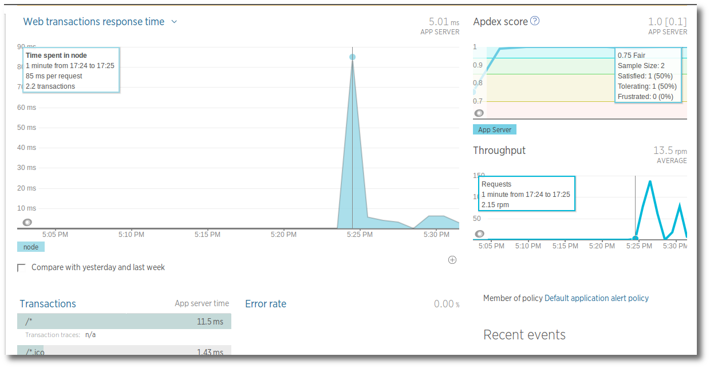
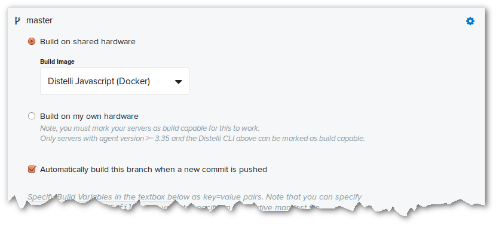
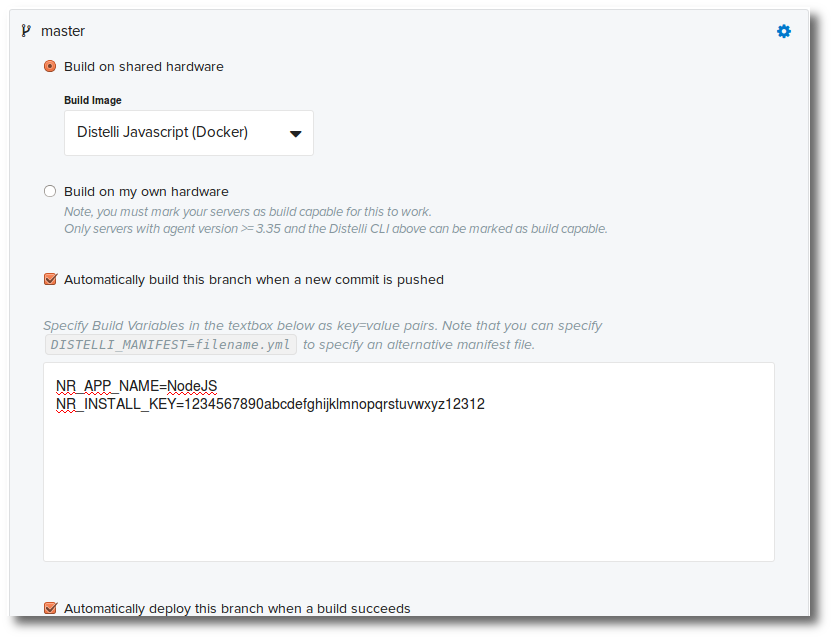
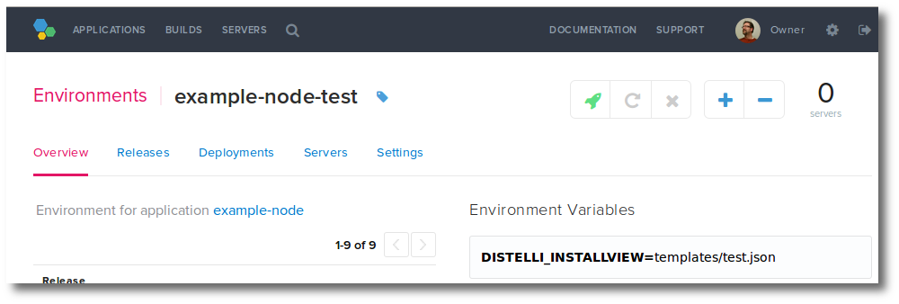
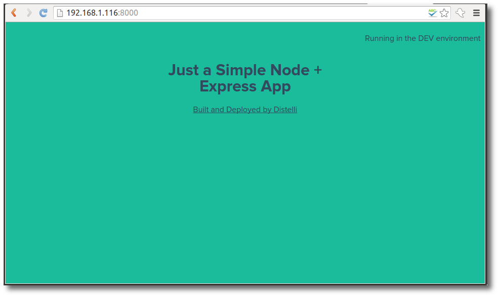

This month I have been focused on deployment integrations with Pipelines. 

In this tutorial I will discuss deploying and configuring the New Relic Application Performance Monitoring (APM) agent during a Pipelines deploy.

New Relics APM is a great tool for surfacing issues in your application, providing end-to-end transaction tracing, application metrics, and deep insight into performance.

Based on customer activity I chose to integrate the New Relic APM agent with 2 of my example applications. One NodeJS app and a simple PHP application. Below I will deep dive into the NodeJS solutions. When I find time I will write about the PHP solution.

<h3>Steps</h3>

If you don't already use New Relic head over to <a href="http://newrelic.com/" target="_blank">New Relic</a> and grab yourself a free trial account.

Also, if you don't already use <a href="https://pipelines.puppet.com/signup" target="_blank">Pipelines</a>, we also have free accounts. Sign up today.

<h3>NodeJS App</h3>

The nodejs application is a simple node express web app. Here at Pipelines we use it to exemplify build and deployments.

The original application can be found in <a href="https://github.com/alexleventer/NodeExpress" target="_blank">this repository</a>.

With New Relic APM you must install the New Relic APM agent that is appropriate for the language of your application.

For nodejs, add the dependency to your package.json and a `require('newrelic');` to your applications main module.

Here is the `package.json`.

~~~  
    "dependencies": {
    "newrelic": "^1.20.0",
    "body-parser": "^1.13.2",
    "express": "^4.13.1",
    "grunt": "^0.4.5",
    "jade": "^1.10.0",
    "nodemon": "^1.3.8",
    "path": "^0.11.14"
  }
~~~

The last bit is to inject your New Relic license key and application name into the newrelic.js file. To accomodate this I used Pipelines environment variables and `sed` to inject the correct values. You can see this example in the manifest below.

<h3>Pipelines Manifest</h3>

If you've used Pipelines, you are familiar with the `distelli-manifest.yml` file. This file contains the build, test, and deploy instructions for an application. My final manifest to build, test, and deploy my nodejs application with New Relic is:

~~~
bmcgehee/example-node:
  # Distelli Manifest example

  PreBuild:
    - echo "---Preparing for Build---"
    - set +e; source /etc/profile; set -e
    - nvm install v4.2.1

  Build:
    - echo "---Building---"
    - npm install
    - mv node_modules/newrelic/newrelic.js .
    - sed -i "s|license key here|$NR_INSTALL_KEY|g" newrelic.js
    - sed -i "s|My Application|$NR_APP_NAME|g" newrelic.js
    - echo "--Testing--"
    - npm test

  PkgInclude:
    - '*'

  PreInstall:
    - echo "---Begining PreInstall---"
    - echo "--Installing deploy dependencies--"
    - echo "-Updating apt-get-"
    - sudo apt-get -y update
    - echo "-Installing nvm pre-requisites-"
    - sudo apt-get -y install build-essential libssl-dev curl
    - echo "-Installing nvm-"
    - curl -o- https://raw.githubusercontent.com/creationix/nvm/v0.26.0/install.sh | bash
    - set +e; source ~/.nvm/nvm.sh; set -e
    - echo "-Installing nodejs-"
    - nvm install v4.2.1

  InstallTemplates:
    - "views/index.jade"

  Env:
    - DISTELLI_INSTALLVIEW: "templates/notset.json"
    - PORT: "8000"

  Exec:
    - set +e; source ~/.nvm/nvm.sh; set -e
    - nvm use v4.2.1
    - node app.js
~~~

Let's look at each section in more detail.

<h4>Username/Application:</h4>

~~~
bmcgehee/example-node:
~~~

The first line of the manifest must be your Pipelines username followed by the application's name.

<h4>PreBuild:</h4>

~~~  
PreBuild:
    - echo "---Preparing for Build---"
    - set +e; source /etc/profile; set -e
    - nvm install v4.2.1
~~~

When I created this application in Pipelines I set it up to build on shared hardware using the Pipelines Javascript Docker build image.

You can find the above options in Pipelines by:

1. Navigate to the application.
2. Click <b>Settings</b>.
3. Expand the <b>Repository</b> section.
4. Expand the <b>repo branch</b>.

Here you will find the build settings.

The Javascript Docker build image includes the tools needed to build and test your nodejs app.

<h4>Build:</h4>

~~~  
Build:
    - echo "---Building---"
    - npm install
    - mv node_modules/newrelic/newrelic.js .
    - sed -i "s|license key here|$NR_INSTALL_KEY|g" newrelic.js
    - sed -i "s|My Application|$NR_APP_NAME|g" newrelic.js
    - echo "--Testing--"
    - npm test
~~~

In the build section I am building my application. Once built, I move the `newrelic.js` file to the appropriate place and install the license key and set the application name for New Relic.

The license and application name are configured as build environment variables. You can find these in the same place you found the build image selection (above).

<h4>PkgInclude:</h4>

~~~  
PkgInclude:
    - '*'
~~~

After a successful build, Pipelines will bundle the artifacts into a release. The package include section defines what files to include in the release.

<h4>PreInstall:</h4>

~~~  
PreInstall:
    - echo "---Begining PreInstall---"
    - echo "--Installing deploy dependencies--"
    - echo "-Updating apt-get-"
    - sudo apt-get -y update
    - echo "-Installing nvm pre-requisites-"
    - sudo apt-get -y install build-essential libssl-dev curl
    - echo "-Installing nvm-"
    - curl -o- https://raw.githubusercontent.com/creationix/nvm/v0.26.0/install.sh | bash
    - set +e; source ~/.nvm/nvm.sh; set -e
    - echo "-Installing nodejs-"
    - nvm install v4.2.1
~~~

The pre-install phase occurs during deployment. In this scenario I am installing my dependencies before installing and running the nodejs application.

On deployments I want to ensure I am using the same version of node as I did during the build. To do so, I am using Node Version Manager (nvm) just as I did during the build process.

<h4>InstallTemplates:</h4>

~~~  
InstallTemplates:
    - "views/index.jade"
~~~

Templates is an exciting new feature from Pipelines that allows you to replace text in a file. For more information on this feature see [Working with Templates on Deploy](./manifest-template.html).

For this scenario I wanted a message in the top right of my web application reminding me if I am working in Dev, Test, or Prod. There is no message if in production.

In the <a href="https://github.com/alexleventer/NodeExpress" target="_blank">NodeExpress repository</a> the `view/index.jade` file defines the web content. Here is where I need to add the content to display a message. I added the following content to the body:

~~~    
#message
      {{#display_msg}}
        &lt;p&gt;Running in the {{this_env}} environment&lt;/p&gt;
      {{/display_msg}}
~~~

`#message` - I added a #message &lt;div&gt; to my style sheet that locates the text in the top right.

`{{#display_msg}} {{/display_msg}}` - Is a conditional that displays only the block(s) inbetween if `display_msg` is set.

`
Running in the {{this_env}} environment
` - When the conditional above is true, this line will display with the `this_env` value injected.

Next I created 4 template files to feed in the values. They are as follows:

`templates/dev.json` for <b>dev</b> environment deploys.

~~~
{
  "display_msg": true,
  "this_env":"DEV"
}
~~~

`templates/test.json` for <b>test</b> environment deploys.

~~~
{
  "display_msg": true,
  "this_env":"TEST"
}
~~~

`templates/prod.json` for <b>production</b> deploys.

~~~
{
  "display_msg": false,
  "this_env":"PROD"
}
~~~

`templates/notset.json` for when the variable isn't correctly set.

~~~
{
  "display_msg": true,
  "this_env":"DISTELLI_INSTALLVIEW variable not set"
}
~~~

As you can see from the above full manifest I am setting the Pipelines templates environment variable:

~~~  
Env:
    - DISTELLI_INSTALLVIEW: "templates/notset.json"
~~~

This then becomes the default value. In my application environment variables I am overriding this value.

And when this is deployed to the `example-node-dev` environment, the application will have the appropriate message.

<h4>Env:</h4>

~~~  
Env:
    - DISTELLI_INSTALLVIEW: "templates/notset.json"
    - PORT: "8000"
~~~

This section sets the default template and defines the port number for the application.

<h4>Exec:</h4>

~~~  
Exec:
    - set +e; source ~/.nvm/nvm.sh; set -e
    - nvm use v4.2.1
    - node app.js
~~~

And lastly, this section executes the application. As the application starts, so will the New Relic agent start and begin sending data back to New Relic. I found it took some traffic (I refreshed the page repeatedly) and a couple minutes before you can start seeing results at New Relic.

