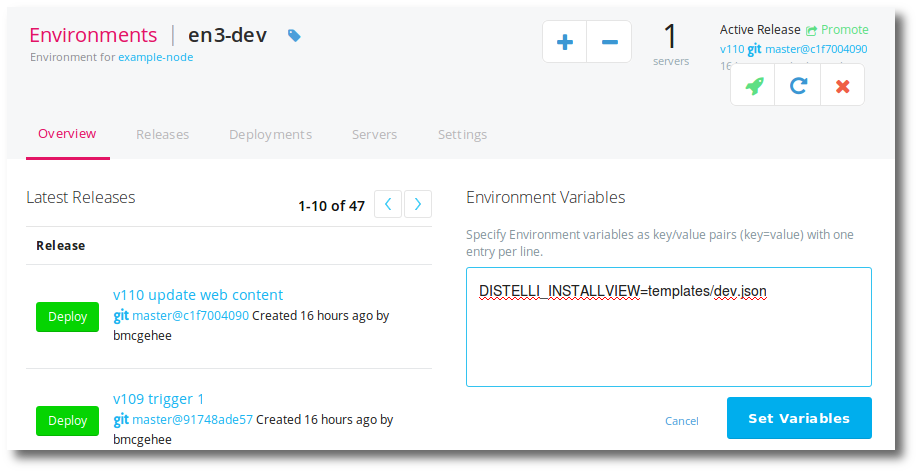
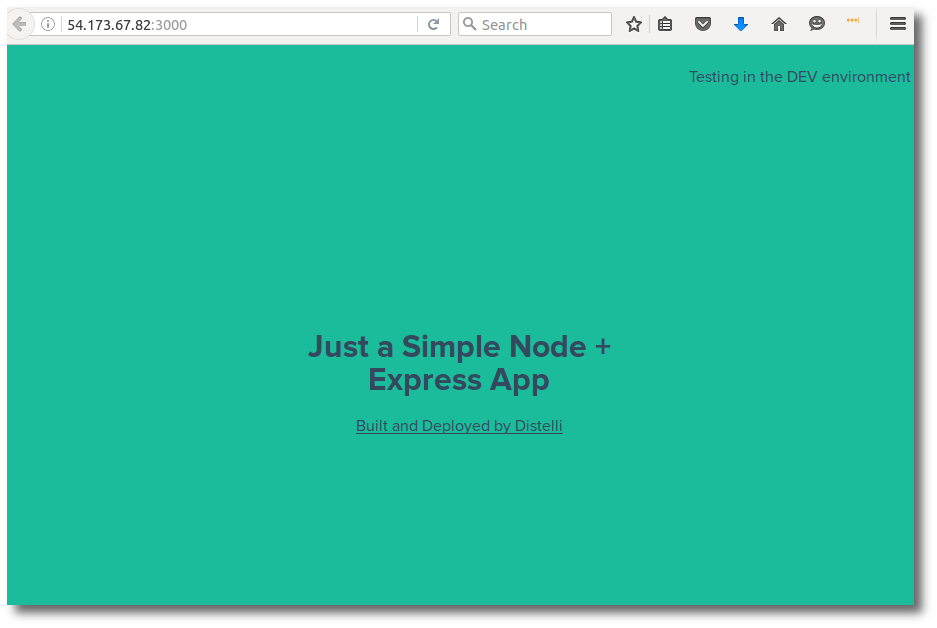

The template feature in Pipelines for Applications allows you to dynamically create and modify HTML, source code, configurations, and text files.

This feature is based on the Mustache open source library. For more information see [mustache.github.io](https://mustache.github.io/).

> **Note:** This feature requires the Distelli agent version 3.49 or greater.

## Overview

Given a template, and a hash of data, Pipelines for Applications can appropriately replace tags with values. For example, here is a basic template file named `templates/Hello.template`.


~~~
Hello {{name}}
~~~


And here is a hash file named `views/Hello.data`.

~~~
{
  "name": "World"
}
~~~

Will produce the following.

~~~
Hello World
~~~

To implement this with Distelli during a deploy you must include the following in the `distelli-manifest.yml` file.

~~~
jdoe/TemplateApp:
  Env:
    - DISTELLI_INSTALLVIEW: '"views/Hello.data"'
  InstallTemplates:
    - [ "templates/Hello.template","." ]
  PkgInclude:
    - 'templates/Hello.template'
    - 'views/Hello.data'
~~~

## Specify a Template

You can specify multiple templates. Realize that all template data will be used on all templates.

Templates are specified in the `distelli-manifest.yml` **InstallTemplates** section. You can specify one or more templates. The syntax is:

~~~
  InstallTemplates:
    - [ TEMPLATE_FILE,RELATIVE_OUTPUT_DESTINATION ]
    - TEMPLATE_FILE
~~~

* **TEMPLATE_FILE** is the directory and name of the template file. This file can be templatized in place or templatized into another directory with RELATIVE_OUTPUT_DESTINATION.

* **RELATIVE_OUTPUT_DESTINATION** is the directory where the merged file should reside.

This is relative to [$DISTELLI_INSTALLHOME](./environment-variable.html#distelliinstallhome).

> **Caution:** The TEMPLATE_FILE should not be in the same directory as the RELATIVE_OUTPUT_DESTINATION during the InstallTemplate phase.

## Specifying template data

Multiple sources of data can be supplied. These files are loaded into the context in order, so the last file in the list *wins*.

Template data is specified in an environment variable in the `distelli-manifest.yml` file. The syntax is.

~~~
  Env:
    - DISTELLI_INSTALLVIEW: '"TEMPLATE_DATA_FILE"'
~~~

* **TEMPLATE_DATA_FILE** is a comma-separated list of the directory and name of the template data file(s).

## Examples

**Example 1:** This example depicts using a conditional section.

`templates/HelloWorld.template`


~~~
{{greeting}} {{name}}!
{{#expect}}
You were expected.
{{/expect}}
~~~


`views/HelloWorld.data`

~~~
{
  "greeting": "Hello",
  "name": "World",
  "expect": true,
}
~~~

`distelli-manifest.yml`

~~~
jdoe/TemplateApp:
  Env:
    - DISTELLI_INSTALLVIEW: '"views/HelloWorld.data"'
  InstallTemplates:
    - [ "templates/HelloWorld.template","." ]
~~~

Produces this output file `./HelloWorld.template`.

~~~
Hello World!
You were expected.
~~~

**Example 2:** This example depicts iterating through multiple values of data.

`templates/HelloWorld.template`


~~~
{{#greetings}}
  {{greeting}} {{name}}!
  {{#expect}}
  You were expected.
  {{/expect}}
{{/greetings}}
~~~


`views/HelloWorld.view`

~~~
{
  "greetings": [
    {
      "greeting": "Hello",
      "name": "World",
      "expect": true,
    },
    {
      "greeting": "Hello",
      "name": "Bob",
      "expect": false,
    },
    {
      "greeting": "Hi",
      "name": "Alice",
      "expect": true,
    },
  ]
}
~~~

`distelli-manifest.yml`

~~~
jdoe/TemplateApp:
  Env:
    - DISTELLI_INSTALLVIEW: '"views/HelloWorld.data"'
  InstallTemplates:
    - [ "templates/HelloWorld.template","." ]
~~~

Produces this output file `./HelloWorld.template`.

~~~
Hello World!
You were expected.
Hello Bob!
Hi Alice!
You were expected.
~~~

**Example 3:** This is an advanced example showing dependencies between templates.

`templates/nginx.conf`


~~~
server {
    listen {{PORT}};
    root /usr/share/www;
    {{#locations}}{{>nginx-locations}}{{/locations}}
}
~~~


`templates/nginx-locations.conf`


~~~
location {{&url}} {
    root {{&root}}
}
~~~


`views/partials.yml`

~~~
partials:
    nginx-locations: "../templates/nginx-locations.conf"
~~~

`views/locations.yml`

~~~
locations:
    - url: /www
      root: /usr/share/www
    - url: /bar
      root: /home/bmcgehee/bar
~~~

`distelli-manifest.yml`

~~~
jdoe/TemplateApp:
  InstallTemplates:
        - [ "templates/nginx.conf", "." ]
    Env:
        - PORT: "8010"
        - DISTELLI_INSTALLVIEW: '"view/partials.yml,view/locations.yml"'
~~~

Produces this output file `./nginx.conf`.

~~~
server {
    listen 8010;
    root /usr/share/www;
location /www {
    root /usr/share/www
}

location /bar {
    root /home/bmcgehee/bar
}

}
~~~

**Example 4:** This example uses environment variables to populate the template data values.

`templates/nginx.conf`


~~~
server {
    listen {{PORT}};
    root {{&ZPATH}};
}
~~~


> **Note:** If the **&** (ampersand) in front of the environment variable ZPATH is not used, the returned value will be html escaped.

`distelli-manifest.yml`

~~~
jdoe/TemplateApp:
  InstallTemplates:
        - [ "templates/nginx.conf", "." ]
    Env:
        - PORT: "80"
        - ZPATH: "/usr/share/www"
~~~

Produces this output file `./nginx.conf`.

~~~
server {
    listen 80;
    root /usr/share/www;
}
~~~

**Example 5:** This example shows how data is injected conditionally.

In this example, I want a message on the web page if this is deployed to anything other than <b>Production</b>.

The following file, ultimately, creates web page content on deploy. 

`views\index.jade`


~~~
doctype html
html
  head
    meta(charset='utf-8')
    meta(http-equiv='X-UA-Compatible', content='IE=edge')
    title Just a simple Node + Express app
    link(rel='stylesheet', href='./style.css')
  body
    #message
      {{#display_msg}}
        &lt;p&gt;Testing in the {{this_env}} environment&lt;/p&gt;
      {{/display_msg}}
    #container
      h1 Just a Simple Node + Express App
      h1 #{date}
      a(href="https://www.distelli.com" target="_blank") Built and Deployed by Distelli
~~~


Note the <b>{{#display_msg}}</b> and <b>{{/display_msg}}</b> pair. This represents a conditional. Only when <b>display_msg</b> is true will the inside line be injected and shown. Otherwise, the line will not exist.

The following templates are specified in the Distelli application environment variable DISTELLI_INSTALLVIEW. The <b>dev</b> environment will use the following template.

`templates/dev.json`

~~~
{
  "display_msg": true,
  "this_env":"DEV"
}
~~~

The <b>QA</b> or <b>test</b> environment will use the following template.

`templates/test.json`

~~~
{
  "display_msg": true,
  "this_env":"TEST"
}
~~~

And finally the Production environment will use the following template. Note that display_msg is false.

`templates/prod.json`

~~~
{
  "display_msg": false,
  "this_env":"PROD"
}
~~~

And one last template to remind users to set the Distelli application environment variable.

`templates/notset.json`

~~~
{
  "display_msg": true,
  "this_env":"DISTELLI_INSTALLVIEW variable not set"
}
~~~

Below depicts the Pipelines application environment "en3-dev" and the correct setting of the environment variables. 

Each environment, for this application, will have different environment variables as such:

* dev = templates/dev.json
* qa/test = templates/test.json
* prod = templates/prod.json

`distelli-manifest.yml`

~~~
  Env:
    - DISTELLI_INSTALLVIEW: "templates/notset.json"
 
  InstallTemplates:
    - "views/index.jade"
~~~

And here is the result on a deploy to the <b>dev</b> environment. Observe the message in the top right.

You can find this last example 5 implemented [here](https://github.com/Distelli/example-template").

