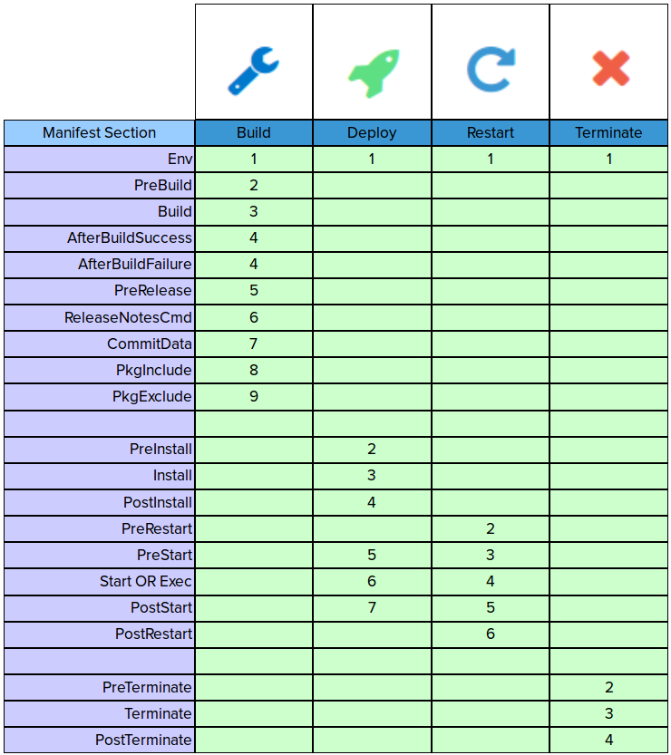
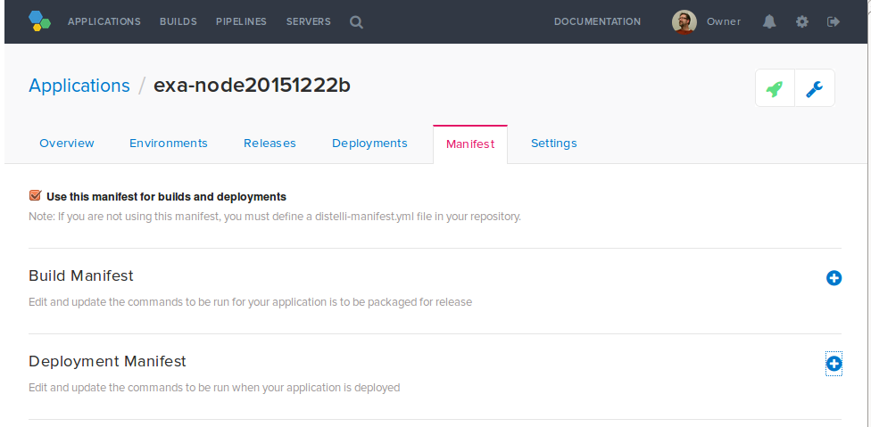
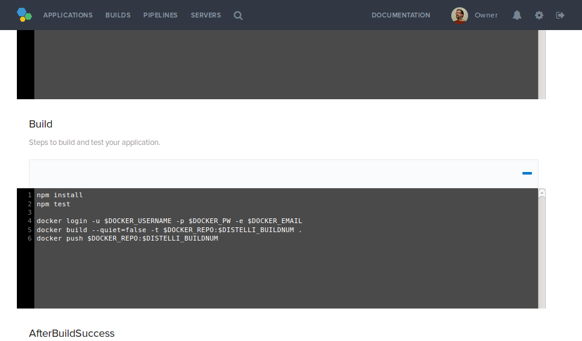

---
layout: default
title: "Application manifest"
--- 

The Puppet Pipelines for Applications application manifest is a set of instructions that describes how to build, test, package, and deploy your application. An application manifest is required for each application in Pipelines for Applications.

You can manage your manifest in either a `distelli-manifest.yml` file in your repository, or in the in-app manifest screen found in the Pipelines web UI.

## Manifest sections

Your manifest file contains instructions about how to build and deploy your application. The manifest is broken into four distinct sections:   

1. The [**Build**](./manifest-build.html) section contains instructions for cloning the repository, building the application, and (on success) creating a release.
1. The [**Deploy**](./manifest-deploy.html) section contains instructions for deploying the application release to the servers in the application environment.
1. The [**Restart**](./manifest-restart.html) section contains instructions for stopping the existing application process that was started with a manifest's `Exec` section, then attempting to start the process again.
1. The [**Terminate**](./manifest-terminate.html) section contains instructions for stopping the existing application process that was started with a manifest's `Exec` section, then removing the application from the server.

Commands in each section are processed in a specific order depending on the deployment type: 

## Understanding the differences between Exec and Start

When deploying applications, you can run your application with either the Exec section or the Start section of the Pipelines manifest, but not both. If both sections are populated, only the Exec section will be executed.

The **Exec** section of the Pipelines manifest is used for starting a foreground process that will be distinctly monitored by the Pipelines Agent. After deploy, if the process started by the Exec section is stopped by anything but the Pipelines agent, the agent will attempt to restart the process by re-executing the Exec section command(s).

This section should not be used to start a background process or daemon. The process started by the Exec section should not fork itself into the background, it should actively run. If the process started in the Exec section forks into the background and the agent cannot actively monitor it, the deploy will fail.

Use the `Exec` section for things like:

* Starting a Node.js application.

~~~
username/appname:
  Exec:
    - node app.js
~~~

* Starting a Java application.

~~~
username/appname:
  Env:
    - CLASSPATH: 'target/*:lib/*'
    - JAVA_HOME: "/usr/lib/jvm/default-java/jre"
    - JVM_ARGS: '"-Duser.timezone=UTC -Xmx128M -Xms128M"'
    - PORT: "8001"
    - ARGS: "$PORT"
  Exec:
    - $JAVA_HOME/bin/java -cp $CLASSPATH $JVM_ARGS com.example.app.SimpleJavaApp $ARGS
~~~

* Running a C# application.

~~~
username/appname:
  Exec:
    - release\webserver.exe
~~~

The foreground process of your application should be executed only in the `Exec` section of the manifest.

The **Start** section of the Pipelines manifest is used for starting a background process that will not be monitored by the Pipelines agent.

Use the `Start` section for things like:

* Starting NGINX or Apache.

~~~
username/appname:
  Start:
    - sudo service nginx start
~~~

* Starting a Node.js application with `forever`.

~~~
username/appname:
  Start:
    - forever start app.js
~~~

* Starting a database daemon.

~~~
username/appname:
  Start:
    - bin/monogodb fork
~~~

Daemons and background processes can be started, restarted, and stopped in other sections of the manifest besides the `Start` section, such as `PreInstall`, `PostInstall`, `PreStart`, and `Terminate`.

> **Note:** The manifest examples are in YAML format and exmplify using a distelli-manifest.yml file. If using the Pipelines web UI manifest, the indentation and prefix formatting is unecessary.

## Formatting the distelli-manifest.yml file 

The Pipelines for Applications application manifest file is a YAML configuration file that is saved with your application code. An example manifest may look like this:

~~~
jdoe/example-node:
  Build:
    - npm install
    - npm test
  PkgInclude:
    - '*'
  PreInstall:
    - sudo apt-get -y update
    - sudo apt-get -y install nodejs
  Env:
    - PORT: "3000"
  Exec:
    - nodejs app.js
~~~

### Naming the manifest file

The manifest is in YAML format. The root element of the YAML file is the username and name of the application separated by a slash and terminated by a colon, such as `jdoe/RubyUbuntuRbenvApp:`. 

> **Note:** Indentation using spaces, not tabs, is critical.

> **Important:** When [creating a new application](./application-create.html) in the Pipelines for Applications web UI, the application name you submit in the **Review your build configuration** step must exactly match the name of the `distelli-manifest.yml` file. If there is a mismatch between the application names, the application will fail to build.

### Using multilines in YAML

There are two types of multilines in YAML: literal style and folded style. 

Literal style is designated by a <b>|</b> (pipe) character, and keeps the new lines and spacing as-is. With literal style, the new line is kept intact.

The following example will run four commands:

~~~
-
|
  echo "Installing ruby 1.9.3"
  rbenv install -v 1.9.3-p551
  rbenv global 1.9.3-p551
  ruby -v
~~~

Folded style is designated by a **>** character, and replaces new lines with spaces and concatenates the lines. With folded style, the new line is converted to a space so that it becomes a single concatenated string.

The following example will run one command:

~~~
-
>
  bundle install
  --binstubs $DISTELLI_APPHOME/bundle/bin
  --standalone
  --path $DISTELLI_APPHOME/bundle/lib
~~~

> **Note:** The first line before the multiline must be an empty line starting with a dash.

The following sample manifest file uses both literal and folded style: 

~~~
jdoe/RubyUbuntuRbenvApp:
  Env:
    - EXAMPLE: >
      This is an example environment variable
      that spans multiple lines.
      Becuase it uses folded, the newlines will
      be changed to spaces.
  PreInstall:
    - echo "Begin PreInstall"
    - VARRUBY="$(ruby -v || true)"
    - if [[ ${VARRUBY:0:10} == "ruby 1.9.3" ]]; then
    - echo "ruby 1.9.3 exists"
    - else
    -
    |
      echo "Installing ruby 1.9.3"
      rbenv install -v 1.9.3-p551
      rbenv global 1.9.3-p551
      ruby -v
    - fi
  Exec:
    - eval "$(~/.rbenv/bin/rbenv init -)"
    - exec ./bundle/bin/thin start -p $PORT -e $STAGE
  PostInstall:
    - echo "begin PostInstall"
    - eval "$(~/.rbenv/bin/rbenv init -)"
    -
    >
      bundle install
      --binstubs $DISTELLI_APPHOME/bundle/bin
      --standalone
      --path $DISTELLI_APPHOME/bundle/lib
    - echo "done PostInstall"
  PkgInclude:
    - lib/simplerubyapp/*.rb
    - Gemfile
    - config.ru
    - SimpleRubyApp.gemspec
~~~

## Editing the manifest in the Pipelines web UI

The Pipelines for Applications application manifest can be managed in the web UI with an in-app manifest. Navigate to an application and then click **Manifest**. Here you can edit the build and deployment steps of the manifest.

## Manifest examples

This table provides links to example applications with example `distelli-manifest.yml` files.

<table cellpadding="2" cellspacing="2">
  <tr>
    <th>
      
Language 
      

    </th>
    <th>
      
Application 
      

    </th>
    <th>
      
Ubuntu 14/15 
      

    </th>
    <th>
      
Centos 7 
      

    </th>
    <th>
      
Redhat 6 
      

    </th>
    <th>
      
Windows 
      

    </th>
  </tr>
  <tr>
    <td>
      
Bash

    </td>
    <td>
      
Simple

    </td>
    <td>
      
<a href="https://github.com/Distelli/example-bash.git" target="_blank">Repo</a>

    </td>
    <td>
      
<a href="https://github.com/Distelli/example-bash.git" target="_blank">Repo</a>

    </td>
    <td></td>
    <td></td>
  </tr>
  <tr>
    <td>
      
Go

    </td>
    <td>
      
Simple

    </td>
    <td>
      
<a href="https://github.com/Distelli/GoUbuntuSimpleApp.git" target="_blank">Repo</a>

    </td>
    <td>
      
<a href="https://github.com/Distelli/GoCentOSSimpleApp.git" target="_blank">Repo</a>

    </td>
    <td></td>
    <td></td>
  </tr>
  <tr>
    <td>
      
Java

    </td>
    <td>
      
Simple

    </td>
    <td>
      
<a href="https://github.com/Distelli/JavaUbuntuSimpleApp.git" target="_blank">Repo</a>

    </td>
    <td>
      
<a href="https://github.com/Distelli/JavaCentOSSimpleApp.git" target="_blank">Repo</a>

    </td>
    <td></td>
    <td></td>
  </tr>
  <tr>
    <td>
      
Node

    </td>
    <td>
      
Simple

    </td>
    <td>
      
<a href="https://github.com/Distelli/NodeUbuntuSimpleApp.git" target="_blank">Repo</a>

    </td>
    <td>
      
<a href="https://github.com/Distelli/NodeCentOSSimpleApp.git" target="_blank">Repo</a>

    </td>
    <td></td>
    <td></td>
  </tr>
  <tr>
    <td>
      
Node

    </td>
    <td>
      
Simple w/ Provisioning

    </td>
    <td>
      
<a href="https://github.com/Distelli/NodeUbuntuPSimpleApp.git" target="_blank">Repo</a>

    </td>
    <td>
      
<a href="https://github.com/Distelli/NodeCentOSPSimpleApp.git" target="_blank">Repo</a>

    </td>
    <td></td>
    <td></td>
  </tr>
  <tr>
    <td>
      
PHP

    </td>
    <td>
      
Simple

    </td>
    <td>
      
<a href="https://github.com/Distelli/PHPUbuntuSimpleApp.git" target="_blank">Repo</a>

    </td>
    <td>
      
<a href="https://github.com/Distelli/PHPCentOSSimpleApp.git" target="_blank">Repo</a>

    </td>
    <td></td>
    <td>
      
<a href="https://github.com/Distelli/WinPHPApp.git" target="_blank">Repo</a>

    </td>
  </tr>
  <tr>
    <td>
      
PHP

    </td>
    <td>
      
Simple w/ Provisioning

    </td>
    <td>
      
<a href="https://github.com/Distelli/PHPUbuntuPSimpleApp.git" target="_blank">Repo</a>

    </td>
    <td>
      
<a href="https://github.com/Distelli/PHPCentOSPSimpleApp.git" target="_blank">Repo</a>

    </td>
    <td></td>
    <td>
      
<a href="https://github.com/Distelli/WinPHPPapp.git" target="_blank">Repo</a>

    </td>
  </tr>
  <tr>
    <td>
      
PHP

    </td>
    <td>
      
Apache

    </td>
    <td>
      
<a href="https://github.com/Distelli/PHPApacheUbuntu.git" target="_blank">Repo</a>

    </td>
    <td>
      
<a href="https://github.com/Distelli/PHPApacheCentOS.git" target="_blank">Repo</a>

    </td>
    <td></td>
    <td></td>
  </tr>
  <tr>
    <td>
      
PHP

    </td>
    <td>
      
Apache w/ Provisioning

    </td>
    <td>
      
<a href="https://github.com/Distelli/PHPPApacheUbuntu.git" target="_blank">Repo</a>

    </td>
    <td></td>
    <td></td>
    <td></td>
  </tr>
  <tr>
    <td>
      
PHP

    </td>
    <td>
      
NGINX

    </td>
    <td>
      
<a href="https://github.com/Distelli/PHPNGINXUbuntu.git" target="_blank">Repo</a>

    </td>
    <td></td>
    <td></td>
    <td></td>
  </tr>
  <tr>
    <td>
      
Python

    </td>
    <td>
      
Simple

    </td>
    <td>
      
<a href="https://github.com/Distelli/PythonUbuntuSimpleApp.git" target="_blank">Repo</a>

    </td>
    <td>
      
<a href="https://github.com/Distelli/PythonCentOSSimpleApp.git" target="_blank">Repo</a>

    </td>
    <td></td>
    <td></td>
  </tr>
  <tr>
    <td>
      
Python

    </td>
    <td>
      
Simple w/ Provisioning

    </td>
    <td>
      
<a href="https://github.com/Distelli/PythonUbuntuPSimpleApp.git" target="_blank">Repo</a>

    </td>
    <td>
      
<a href="https://github.com/Distelli/PythonCentOSPSimpleApp.git" target="_blank">Repo</a>

    </td>
    <td></td>
    <td></td>
  </tr>
  <tr>
    <td>
      
Ruby

    </td>
    <td>
      
Simple using RVM

    </td>
    <td>
      
<a href="https://github.com/Distelli/RubyUbuntuSimpleApp.git" target="_blank">Repo</a>

    </td>
    <td>
      
<a href="https://github.com/Distelli/RubyCentOSSimpleApp.git" target="_blank">Repo</a>

    </td>
    <td></td>
    <td></td>
  </tr>
  <tr>
    <td>
      
Ruby

    </td>
    <td>
      
Simple using RVM w/ Provisioning

    </td>
    <td>
      
<a href="https://github.com/Distelli/RubyUbuntuPSimpleApp.git" target="_blank">Repo</a>

    </td>
    <td>
      
<a href="https://github.com/Distelli/RubyCentOSPSimpleApp.git" target="_blank">Repo</a>

    </td>
    <td></td>
    <td></td>
  </tr>
  <tr>
    <td>
      
Ruby

    </td>
    <td>
      
Simple using RBenv w/ Provisioning

    </td>
    <td>
      
<a href="https://github.com/Distelli/RubyUbuntuRbenvApp.git" target="_blank">Repo</a>

    </td>
    <td></td>
    <td></td>
    <td></td>
  </tr>
  <tr>
    <td>
      
IIS

    </td>
    <td>
      
Simple

    </td>
    <td></td>
    <td></td>
    <td></td>
    <td>
      
<a href="https://github.com/Distelli/WinIISApp.git" target="_blank">Repo</a>

    </td>
  </tr>
  <tr>
    <td>
      
IIS

    </td>
    <td>
      
Advanced Blog w/ Provisioning

    </td>
    <td></td>
    <td></td>
    <td></td>
    <td>
      
<a href="https://github.com/Distelli/WinIISBlog.git" target="_blank">Repo</a>

    </td>
  </tr>
  <tr>
    <td>
      
C#

    </td>
    <td>
      
Simple

    </td>
    <td>
      
<a href="https://github.com/Distelli/example-csharp.git" target="_blank">Repo</a>

    </td>
    <td></td>
    <td></td>
    <td>
      
<a href="https://github.com/Distelli/example-csharp.git" target="_blank">Repo</a>

    </td>
  </tr>
</table>

