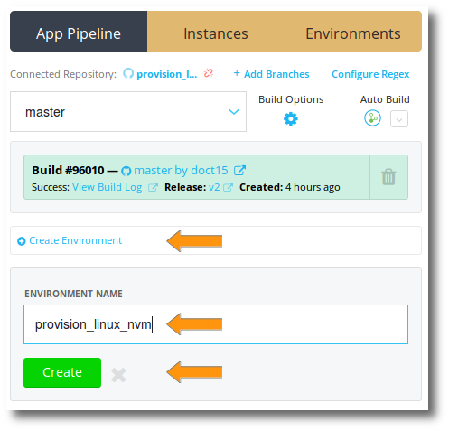
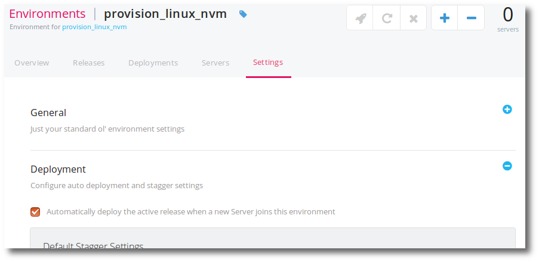
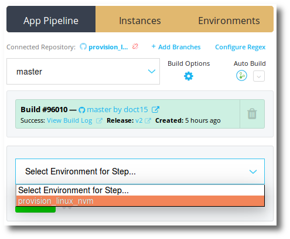
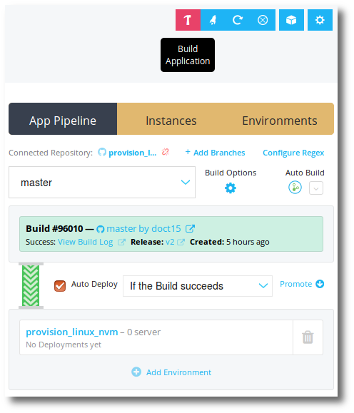
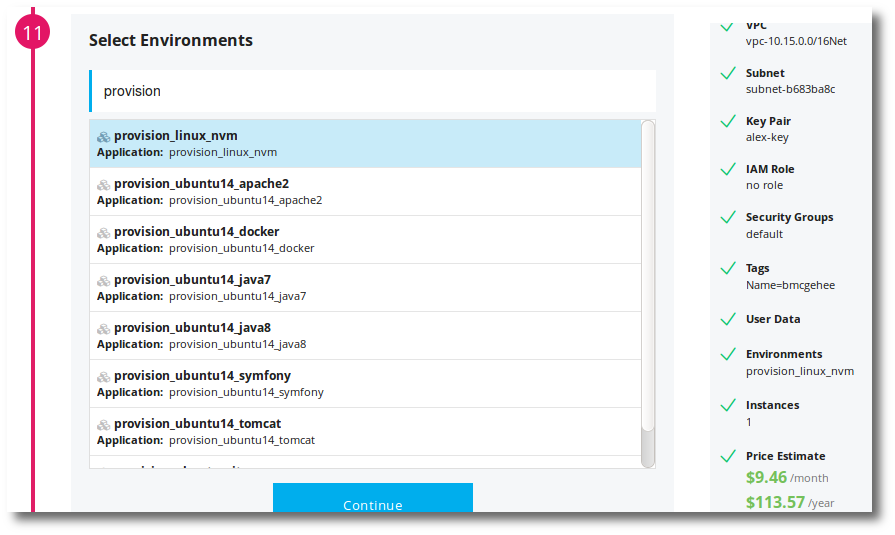
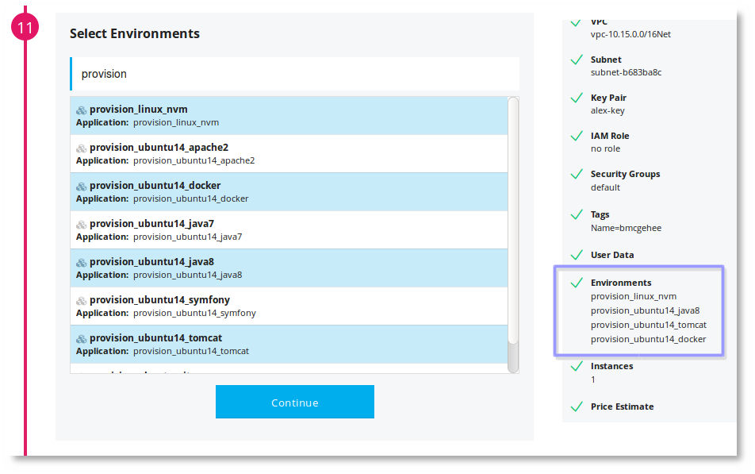

You can create provisioning applications in Pipelines to simplify repetitive tasks. These provisioning applications can be used when spinning up new servers to install prerequisites, or on existing servers.

## Provision script

For this example, lets take a look at an install of Node Version Manager (nvm).

You can find more information on nvm [here](https://github.com/creationix/nvm). 

~~~
curl -o- https://raw.githubusercontent.com/creationix/nvm/v0.31.7/install.sh | bash
~~~

Note: The above syntax expects that <b>curl</b> and <b>bash</b> are already installed. Also realize that using nodejs and npm via nvm may have other requirements like "build essentials." The install for these could be accomodated in this script, or in their own.

The above commands should be placed into the [Install:](./manifest-deploy.html) section of a distelli-manifest.yml.

~~~
DISTELLI_USERNAME/DISTELLI_APPNAME:
  Env:
    NVM_VERSION: "v.0.31.7"
  Install:
    - curl -o- "https://raw.githubusercontent.com/creationix/nvm/$NVM_VERSION/install.sh" | bash
~~~

Replace the following fields:

* DISTELLI_USERNAME - [Your Pipelines username.](./account.html)
* DISTELLI_APPNAME - The name of the application in Pipelines.

## Create the application

You can create a repository for this application and add it to Pipelines, or you can use the Pipelines CLI to create this application in Pipelines.

<h3>Create Pipelines app from repository</h3>

1. Create a repository for the distelli-manifest.yml in one of the many software repositories that Pipelines supports. Give this repository a name like this:

   `provision_linux_nvm`

1. [Create an application in Pipelines from that repository](./application-create.html)

1. Afterward, skip ahead to the **Create the environment** step.

<h3>Create Pipelines app with the Pipelines CLI</h3>

You can create an application in Pipelines without a repository by using the Pipelines CLI. To do so, follow these steps:

1. On the computer where the above distelli-manifest.yml file exists, [install the Pipelines CLI](./cli.html)
1. From the directory where the distelli-manifest.yml sits, execute a  
  <code>distelli create DISTELLI_USERNAME/DISTELLI_APPNAME</code> 
 command to create the application in Pipelines.</li>
 
Remember to replace the above <b>DISTELLI&#95;</b> values.

1. From the directory where the distelli-manifest.yml sits, execute a 
  <code>distelli push</code> 
 command to push the first release of the application.

<h2>Create the environment</h2>

Now that you have the application in Pipelines and you should have a release created. This release would have either been from a build of your repository, or created in the Pipelines CLI push.

<ol>
  <li>In the Pipelines web UI, navigate to your application.</li>
  <li>Click the <b>Create Environment</b> link on the right.</li>
  <li>Name your environment <b>provision_linux_nvm</b>.</li>

  <li>Click Create</li>
</ol>

By default, the option <b>Automatically deploy the active release when a new server joins this environment</b> is enabled. To validate this, navigate to the new environment's <b>Settings</b> page.

## Deploy the release

This section is called <b>Deploy the Release</b>, but it is really about setting the <b>Active Release</b> in an environment.

The active release of an environment is set a couple ways. A successful deploy of a release to an environment will make that release the environments active release.

The other way of setting the active release is to use the Pipelines API call [SetEnvActiveRelease](./api-servers.html).

<ol>
  <li>Navigate to your application in Pipelines.</li>
  <li>In the <b>App Pipeline</b> click the <b>Add Step</b> button.</li>
  <li>From <b>Select Environment for Step</b>, select the environment you just created, <b>provision_linux_nvm</b></li>

  <li>Click the <b>Add</b> button.</li>
  <li>Click (check) the <b>Auto Deploy</b> option that has appeared.</li>
  <li>Click the <b>Hammer</b> Build Application icon at the top right to build a release.</li>

  <li>Finally, click the <b>Build</b> button in the Control Room.</li>
</ol>

Great. Pipelines will now build your application. In this case, you'll receive the message "Nothing to build". After a successful build, a release will be created. Pipelines will automatically deploy this newly created release to the environment <b>provision_linux_nvm</b>.

There are currently 0 of 0 servers and the deploy of 0 will succeed, thus setting the active release of this environment to the newly created release. You are ready to provision servers with this.

Realize, in the future, if you want to update your provisioning script, update the Pipelines manifest, and re-push your code.

<h2>Provision a server</h2>

To provision a server, add the server to the environment <b>provision_linux_nvm</b>. When adding a server to this environment, you will be prompted if you would like to deploy the active release. If "yes" this will run the deploy steps of the distelli-manifest.yml on the server.

If you use Pipelines to provision cloud instances (i.e. AWS, GCE) you can instruct the instance to join the environment <b>provision_linux_nvm</b>. This is where the earlier noted option <b>Automatically deploy the active release when a new Server joins this environment</b> comes into play. As the server joins the environment, it will request the active release and run the deploy steps.

Realize, that if you choose multiple provisioning scripts (environments to join), Pipelines will have the server/instance join all the environments and deploy each ones active release, thus providing multiple provisionings. This is done sequentially.

In the example above, you can see that the following environments have been chosen:

<ul>
  <li>provision_linux_nvm</li>
  <li>Provision_ubuntu14_java8</li>
  <li>provision_ubuntu14_tomcat</li>
  <li>provision_ubuntu14_docker</li>
</ul>

This means the instance will come up, install the Pipelines agent, the agent will connect back to Pipelines, join each environment in sucession, and deploy each environments active release.

<h3>Examples</h3>

Now that you understand how to setup provisioning scripts in Pipelines, here are a handful of examples:

* [Provision Linux NVM](https://github.com/doct15/provision_linux_nvm)
* [Provision Docker on Ubuntu 14](https://github.com/doct15/provision_ubuntu14_docker)
* [Provision Java 7 on Ubuntu 14](https://github.com/doct15/provision_ubuntu14_java7)
* [Provision Java 8 on Ubuntu 14](https://github.com/doct15/provision_ubuntu14_java8)
* [Provision Maven on Ubuntu 14](https://github.com/doct15/provision_ubuntu14_maven)
* [Provision Tomcat on Ubuntu 14](https://github.com/doct15/provision_ubuntu14_tomcat)
* [Provision Git on Ubuntu](https://github.com/doct15/provision_ubuntu_git)
* [Provision Symfony on Ubuntu 14](https://github.com/doct15/provision_ubuntu14_symfony)
* [Provision Apache2 on Ubuntu 14](https://github.com/doct15/provision_ubuntu14_apache2)

