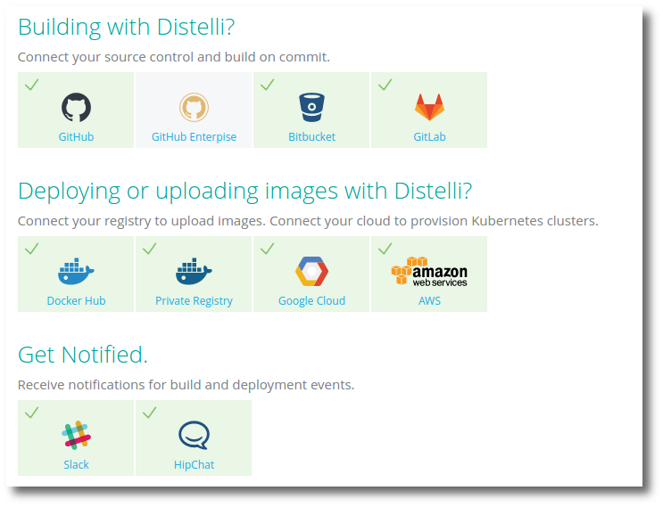

---
layout: default
title: "Integrations"
--- 

Using Kubernetes with Pipelines for Containers requires some integrations depending on what features are required.

Integrations in Pipelines for use with Pipelines for Containers include:

<ul>
  <li><b>Source Control</b> - Where Distelli pulls your software to build your custom containers from a Dockerfile.</li>
  <li><b>Docker Registry</b> - Where Distelli pushes your Docker image after building it. Also, Distelli can deploy containers to kubernetes directly from a docker registry.</li>
  <li><b>Cluster Compute</b> - Currently Distelli can create kubernetes clusters in Google Cloud and Amazon Web Services.</li>
  <ul>
    <li>Distelli can connect to and manage existing clusters in existing clouds, including: </li>
    <ul>
      <li>GKE</li>
      <li>AWS</li>
      <li>Bare Metal</li>
    </ul>
  </ul>
  <li><b>Notification Channels</b> - Where Distelli sends notifications.</li>
</ul>

## Integrate a repository

The master settings for integrating with a repository can be found in your account settings. To change these settings:

1. Click on the gear icon in the top right of the Pipelines web UI.
1. Click <b>Integrations</b> link on the left.
1. Click the repository you wish to integrate with. 

    > **Note:** If you are already connected to a repository, the button will say \Disconnect REPO Account\. To disconnect (terminate) the integration, click the button. If you disconnect a repository that has repositories connected to applications in Pipelines for Applications, the applications will no longer auto build when a repository check-in occurs.

1. Click the "Connect REPO Account" button for the repository you wish to integrate with. You may be prompted to login to the repository and to approve access to the repository. If you have integrated Pipelines previously, you may not be prompted at all. 

After you have approved the integration on the repository, they are integrated.

## Remove Pipelines integration from GitHub

To completely remove Pipelines integration with GitHub:

1. Click on the gear icon in the top right of the Pipelines web UI.
1. Click <b>Integrations</b> link on the left.
1. Select the repository you wish to remove, and click **Disconnect REPO Account**. 
1. Log in to your GitHub account and go to the **Settings** page.
1. On the GitHub settings page click the <b>Applications</b> link. Under Authorized applications, find Distelli Inc. and click the <b>Revoke</b> button.

### Remove GitHub repository webhooks or services

To remove a webhook from a specific repository in GitHub:
<ol>
<li>Log in to your GitHub account.</li>
<li>Navigate to the repository that has webhooks you wish to remove.</li>
<li>Click <b>Settings</b> icon.</li>
<li>Click the <b>Webhooks & Services</b> link.</li>
<li>Remove the hook or service you wish.</li>
</ol>

