This tutorial will walk you through deploying a working WordPress site to a Kubernetes cluster using Pipelines. In doing so, this tutorial will discuss and exemplify the following concepts:

<ul>
  <li>Creating a Dockerfile.</li>
  <li>Building software from a repository.</li>
  <li>Working with Kubernetes secrets.</li>
  <li>Creating and using a persistent disk with Kubernetes.</li>
  <li>Doing a Kubernetes deploy.</li>
  <li>Creating a Kubernetes service and understanding how it exposes your deploy.</li>
  <li>Deploy a second container that communicates with the previous deploy/service.</li>
  <li>Create a service that exposes the second deploy to the world.</li>
</ul>

This tutorial uses the following platforms that you may need to sign up for an account to proceed:

<ul>
  <li>The Pipelines platform to build, deploy, interact with Kubernets, and more.</li>
  <li><a href="https://github.com/">GitHub.com</a> to store your Dockerfile for building.</li>
  <li><a href="https://hub.docker.com/">Docker Hub</a> to store your built docker images.</li>
  <li><a href="https://cloud.google.com/">Google Cloud Platform</a> for the Kubernetes cluster, persistent disk, and services.</li>
</ul>

This tutorial <b>requires</b> that you first have a Google cloud Kubernetes cluster being managed by Pipelines. For more information on clusters see [Clusters](./cluster-add.html). This tutorial is specific to Google cloud.

<h2>Create K8S WordPress Dockerfile</h2>

Part of the tutorial is to exemplify the automation of building and deploying docker images. To do this, you will create a Dockerfile and store it in a GitHub repository.

1. Create a directory to store the Dockerfile in and <code>cd</code> to the new directory.

~~~
mkdir k8s-wordpress
cd k8s-wordpress
~~~

1. With your favorite text editor, create a file in the k8s-wordpress directory called <code>Dockerfile</code>. The filename should begin with a capital "D". The contents of the file are:

~~~
FROM wordpress
VOLUME  ["/var/www/html"]
EXPOSE 80
~~~

1. Save the Dockerfile.

The Dockerfile that you just created will create a WordPress image capable of being deployed to a Kubernetes cluster. There is not much to it. The next Dockerfile will have more stuff happening.

<h2>Push k8s-wordpress to a software repository</h2>

Next you will want to <a href="https://help.github.com/articles/create-a-repo/">create a software repository on github</a> to push the Dockerfile to. You should call the repository k8s-wordpress. You only need to create the repository. The steps to push the Dockerfile up to the repository are below:

~~~
git init
git add Dockerfile
git commit -m "Add new Dockerfile"
git remote add origin git@github.com:YOUR_GITHUB_USER/k8s-wordpress.git
git push -u origin master
~~~

By pushing your dockerfile to the github repository, you can integrate this repository with a multitude of systems to automate the building of docker images. In this tutorial you will use Pipelines.

<h2>Create K8S MySQL Dockerfile</h2>

WordPress requires a MySQL database. You will be creating a MySQL Dockerfile to build and deploy MySQL in support of WordPress.

1. Create a directory to store the Dockerfile in and <code>cd</code> to the new directory. If you are still in the k8s-wordpress directory go back one directory with <code>cd ..</code>.

~~~
mkdir k8s-mysql
cd k8s-mysql
~~~

1. With your favorite text editor, create a file in the k8s-mysql directory called <code>Dockerfile</code>. The contents of the file are:

~~~
FROM mysql:5.7
ENV MYSQL_DATABASE=wordpress 
RUN apt-get update && \
apt-get install -y sed
RUN sed -i "s|#bind-address\t= 127.0.0.1|bind-address = 0.0.0.0|g" /etc/mysql/mysql.conf.d/mysqld.cnf
VOLUME  ["/etc/mysql", "/var/lib/mysql"]
EXPOSE 3306
~~~

In the above Dockerfile, there is a bit more being done than the previous Dockerfile. Let's break down the steps for understanding:

  <ul>
    <li><b>FROM mysql:5.7</b> - This image will be based on an existing image, available publicly, referenced as <code>mysql:5.7</code>.</li>
    <li><b>ENV MYSQL_DATABASE=...</b> - This sets an environment variable that tells MySQL to automatically create a database called <code>wordpress</code>, if it doesn't already exist.</li>
    <li><b>RUN apt-get upd...</b> - This updates the apt-get db and installs <code>sed</code>.</li>
    <li><b>RUN sed ...</b> - This uses sed to adjust the MySQL listener. By default, MySQL only listens on localhost (127.0.0.1) and is unreachable outside of the process it is running in. By changing the <code>bind-address</code> to <code>::</code>, it tells MySQL to listen on all addresses.</li>

    
Note: If you were to run MySQL and WordPress in the same pod, WordPress could access MySQL on the localhost address. This tutorial does not do this to help exemplify how you use Kubernetes services for inter pod communication.

    <li><b>VOLUME ...</b> - This exposes volume mount points that the docker container will require to operate successfully. The MySQL container needs to be able to write data to these two directories.</li>
    <li><b>EXPOSE 3306</b> - This exposes the network TCP port 3306, the one that MySQL listens on by default, to the Kubernetes cluster.</li>
  </ul>

1. Save the Dockerfile.

<h2>Push k8s-mysql to a software repository</h2>

Next you will want to <a href="https://help.github.com/articles/create-a-repo/">create a software repository on github</a> to push the Dockerfile to. You should name this one k8s-mysql. You only need to create the repository. The steps to push the Dockerfile up to it are below:

~~~
git init
git add Dockerfile
git commit -m "Add new Dockerfile"
git remote add origin git@github.com:YOUR_GITHUB_USER/k8s-mysql.git
git push -u origin master
~~~

By pushing your dockerfile to the github repository, you can integrate this repository with a multitude of systems to automate the building of this docker image. In this tutorial you will use Pipelines to automate building and deploying a container.

<h2>Create Pipelines for Containers project</h2>

Next you will create a project in Pipelines to build your container images. For more information about projects in Pipelines see [Projects](./project.html).

The steps for creating a project are also summarized below. 

<ol>
  <li>Login to the Pipelines web UI.</li>
  <li>Ensure you are on the <b>Pipelines for Containers web UI</b> from the drop down at the top left.</li>
  <li>Click <b>Projects</b> from the top menu.</li>
  <li>Click <b>New Project</b> to create a new project.</li>
  <li>Give your project the <b>Project Name</b> <i>WordPress</i>.</li>
  <li>Click <b>Create Project</b>.</li>
</ol>

<h2>Add MySQL container to the project</h2>

First you will add the MySQL container to the project. This will allow you to build and deploy MySQL and get it up before deploying WordPress.

<ol>
  <li>In your WordPress project, click <b>Add Containers</b>.</li>
  <li>Click <b>Connect Source Control</b> button.</li>
  <li>In the resulting Add Container dialog, click <b>Source Control</b> to select your source control.</li>
  <li>Next, click <b>Repository</b> to select your repository.</li>

  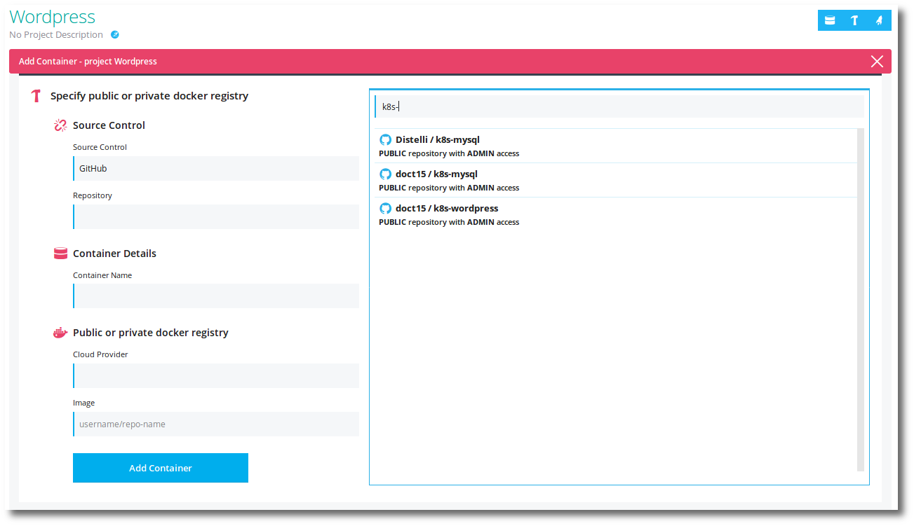

  <li>Fill in the <b>Container Name</b> field with <b>k8s-mysql-container</b>.</li>
  <li>Click <b>Cloud Provider</b> and select your docker registry provider.</li>
  <li>Finally, set the <b>Image</b> name to <b>YOUR_REGISTRY/k8s-mysql-image</b>.</li>

  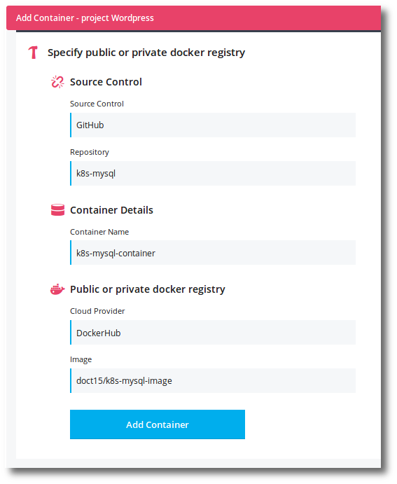

  <li>Click <b>Add Container</b>.</li>
</ol>

<h2>Build the MySQL container</h2>

Let's kick off you're first build of a container. After a successful build, an image will be created that can be deployed to a Kubernetes 

<ol>
  <li>Click on the <b>Build Hammer</b> icon at the top right in your project.</li>

  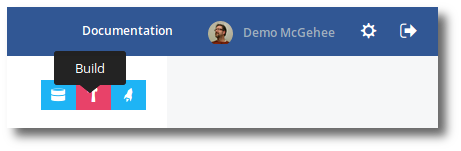

  <li>Select the <b>k8s-mysql-container</b> container.</li>
  <li>Select your <b>Branch</b>. Typically this should be <b>master</b>.</li>

  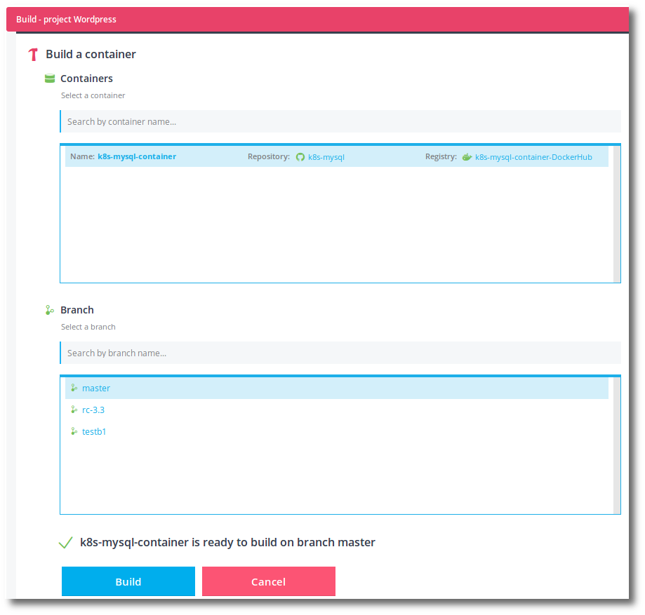

  <li>Click the <b>Build</b> button.</li>
</ol>

You <b>Go To Build!</b> to watch the live build logs. Wait until the build has completed successfully before continuing.

<h2>Create a namespace</h2>

I like to divide my projects up by Kubernetes cluster namespace. Namespaces provide a way to partition deployments, services, and more; in Kubernetes.

<ol>
  <li>Click the <b>Clusters</b> tab at the top of the Pipelines for Containers web UI.</li>
  <li>Click on the <b>Cluster</b> that you wish to deploy this tutorial too, to see the cluster details page.</li>
  <li>Click the <b>Add/Remove Namespaces</b> icon at the top right.</li>

  

  <li>Click <b>Create Namespace</b> button.</li>
  <li>Give your <b>Namespace</b> the name <i>distelli-wordpress</i>.</li>
  <li>Click <b>Create</b> button.</li>
</ol>

<h2>Add MySQL secrets</h2>

You will need to specify a couple environment variables to be used by the running MySQL container. This can be done through Kubernetes secrets. The two environment variables being supplied are:

<ul>
  <li><b>MYSQL_DATABASE=wordpress</b> - The database to create if it doesn't already exist.</li>
  <li><b>MYSQL_ROOT_PASSWORD=password</b> - The default <i>root</i> user password in MySQL.</li>
</ul>

To create the secrets in Pipelines, do the following:

<ol>
  <li>From the cluster details page click <b>Secrets</b> near the top.</li>
  <li>Click <b>+ Add New Secret</b> link.</li>
  <li>Select the <b>Namespace</b> you created earlier <i>distelli-wordpress</i>.</li>
  <li>Give the secret a <b>Secret Name</b> of <i>k8s-mysql-secret</i>.</li>
  <li>Add the secrets. (Feel free to change the password as necessary)</li>
</ol>

~~~
MYSQL_DATABASE=wordpress
MYSQL_ROOT_PASSWORD=password
~~~

  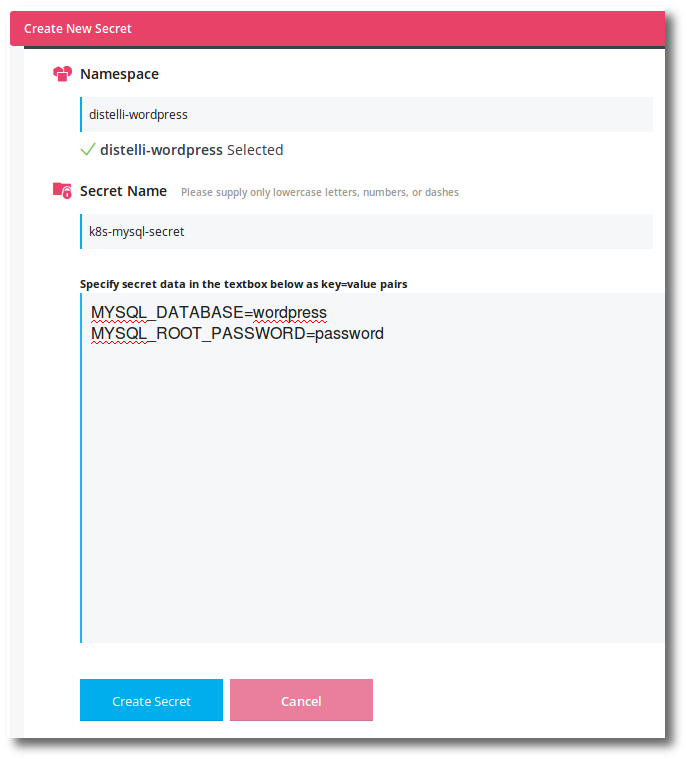

Click <b>Create Secret</b> button to finish.

<h2>Create MySQL persistent disk</h2>

To store information between container runs and updates, MySQL and WordPress will need persistent disks. The MySQL and WordPress mount points will be mounted on the persistent disks.

This tutorial will use Google cloud to create the persistent disks. Realize that the persistent disks <b>must</b> be in the same zone as the Kubernetes cluster.

You can create the persistent disk with the <code>gcloud</code> CLI available <a href="https://cloud.google.com/sdk/downloads">here</a>.

~~~
gcloud compute disks create --size 200GB k8s-mysql-disk --project YOUR_GCLOUD_PROJECT --zone YOUR_K8S_ZONE
~~~

<ol>
  <li>Execute the above command to create a 200GB persistent disk called k8s-mysql-disk.</li>
</ol>

<h2>Deploy the MySQL container</h2>

Next we will deploy the container to the Kubernetes cluster.

<ol>
  <li>In Pipelines navigate to your <b>WordPress</b> project.</li>
  <li>Click the <b>Deploy</b> rocket icon near the top right.</li>
  <li>In the New Deployment select your <b>Cluster</b>.</li>
  <li>Select the <i>distelli-wordpress</i> <b>Namespace</b>.</li>
  <li>Click the <b>Deployment Name</b> field to <b>Create New Deployment</b> named <i>k8s-mysql</i>.</li>
  <li>Enter a <b>Deployment Description</b> of <i>First deploy</i>.</li>
  <li>Click in the <b>Add Container(s)</b> field.</li>

  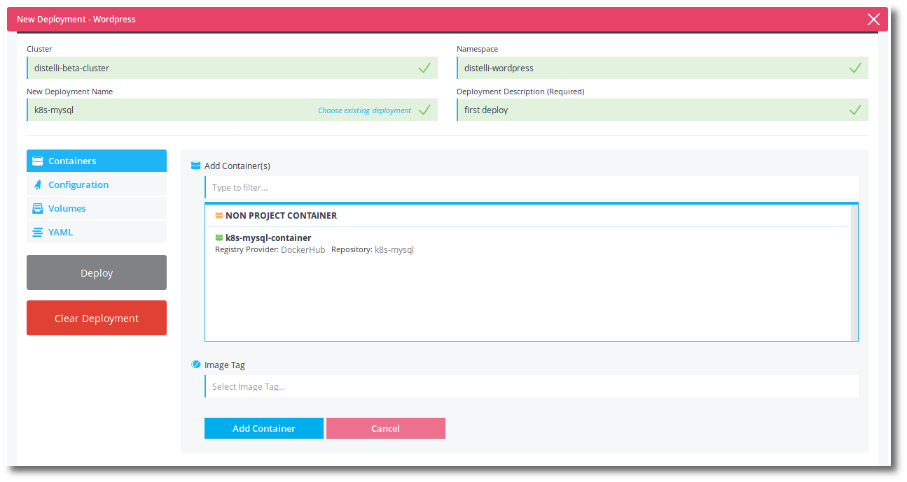

  <li>Just like the above image, you should see your k8s-mysql-container available. Click the <b>k8s-mysql-container</b>.</li>
  <li>Click in the <b>Image Tag</b> field.</li>

  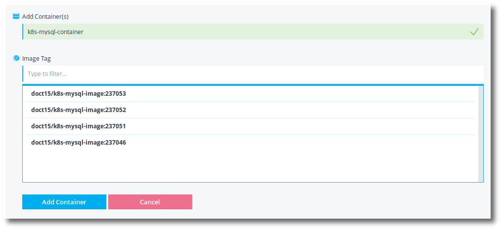

  
If you built your image more than once, you may see more than one image tag.

  <li>Choose the most recent (top) image.</li>
  <li>Click <b>Add Container</b>.</li>

  <li>Click <b>Volumes</b> on the left.</li>
  <li>Click <b>Add Volume</b>.</li>
  <li>Enter the following Values:</li>

  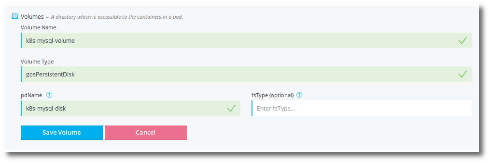

  <ul>
    <li><b>Volume Name</b> - k8s-mysql-volume</li>
    <li><b>Volume Type</b> - gcePersistentDisk</li>
    <li><b>pdName</b> - k8s-mysql-disk</li>
    <li><b>fsType</b> - Leave blank</li>
  </ul>

  <li>Click <b>Save Volume</b>.</li>
  <li>Click on the container <b>k8s-mysql-container</b> on the left, to select it.</li>

  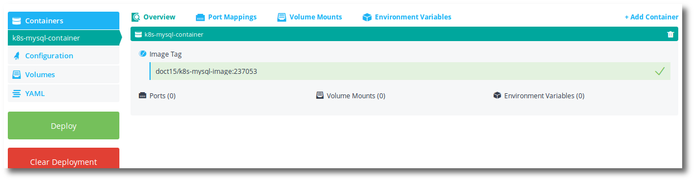

  <li>Click on the tab labeled <b>Port Mappings</b>.</li>
  <li>Click the <b>Add Port Mapping</b> button.</li>
  <li>Set the Port Mapping values to the following:</li>

  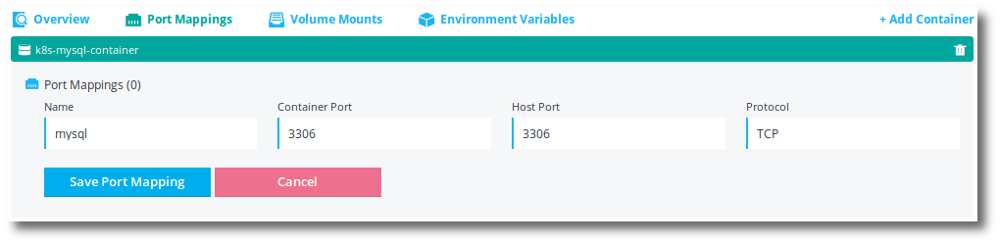

  <ul>
    <li><b>Name</b> - mysql</li>
    <li><b>Container Port</b> - 3306</li>
    <li><b>Host Port</b> - 3306</li>
    <li><b>Protocol</b> - TCP</li>
  </ul>

  <li>Click <b>Save Port Mapping</b>.</li>
  <li>Click on the <b>Volume Mounts</b> tab.</li>
  <li>Click <b>Add Volume Mount</b>.</li>
  <li>Enter the <b>Volume Mount</b> options as shown below:</li>

  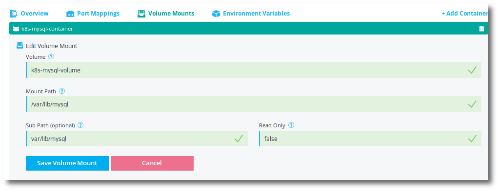

  <ul>
    <li><b>Volume</b> - k8s-mysql-volume</li>
    <li><b>Mount Path</b> - /var/lib/mysql</li>
    <li><b>Sub Path</b> - var/lib/mysql</li>
    <li><b>Read Only</b> - false</li>
  </ul>

  <li>Click <b>Save Volume Mount</b>.</li>
  <li>Click <b>Add Volume Mount</b> to add another.</li>
  <li>Enter the <b>Volume Mount</b> options as shown below:</li>

  <ul>
    <li><b>Volume</b> - k8s-mysql-volume</li>
    <li><b>Mount Path</b> - /etc/mysql</li>
    <li><b>Sub Path</b> - etc/mysql</li>
    <li><b>Read Only</b> - false</li>
  </ul>

  <li>Click <b>Save Volume Mount</b>.</li>
  <li>Click <b>Environment Variables</b> tab.</li>
  <li>Click the <b>Add Variable</b> button.</li>
  <li>Enter the <b>Environment Variable</b> values as shown below:</li>

  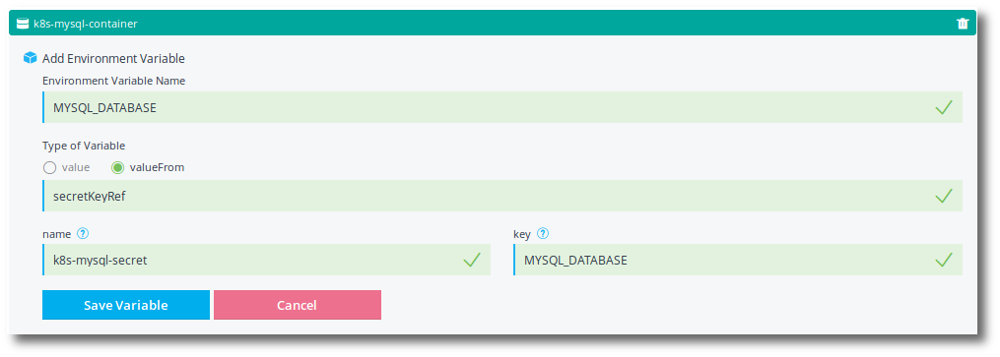

  <ul>
    <li><b>Environment Variable Name</b> - MYSQL_DATABASE</li>
    <li><b>Type of Variable</b> - (x) valueFrom -> secretKeyRef</li>
    <li><b>name</b> - k8s-mysql-secret</li>
    <li><b>key</b> - MYSQL_DATABASE</li>
  </ul>

  <li>Click <b>Save Variable</b>.</li>
  <li>Click <b>Add Variable</b> to add another environment variable.</li>
  <li>Enter the <b>Environment Variable</b> values as shown below:</li>

  <ul>
    <li><b>Environment Variable Name</b> - MYSQL_ROOT_PASSWORD</li>
    <li><b>Type of Variable</b> - (x) valueFrom -> secretKeyRef</li>
    <li><b>name</b> - k8s-mysql-secret</li>
    <li><b>key</b> - MYSQL_ROOT_PASSWORD</li>
  </ul>
  <li>Click <b>Save Variable</b>.</li>
  <li>Click <b>Deploy</b> to initiate a deployment.</li>
</ol>

You can view the deployment details by clicking on the link <b>click here</b>.

<h2>Create MySQL service</h2>

Next you will create a service to expose the k8s-mysql deployment. This service will expose the mysql tcp port 3306 to the cluster. Other deployments to the cluster can discover this service either through environment variables or through domain name service (DNS).

<ol>
  <li>In the <b>WordPress</b> project, click the <b>Services</b> tab.</li>
  <li>Select the <b>Cluster</b> where you deployed the k8s-mysql deployment.</li>
  <li>Click the <b>Create a new service</b> button.</li>
  <li>Paste the following YAML into the <b>Create Service spec in YAML format</b> text area.</li>
</ol>

~~~
apiVersion: v1
kind: Service
metadata:
  name: k8s-mysql
  namespace: distelli-wordpress
spec:
  selector:
    deployment: k8s-mysql
  ports:
  - name: default
    protocol: TCP
    port: 3306
    targetPort: 3306
~~~

Click the <b>Create Service</b> button.

You should note that the spec: > selector: is targeting the k8s-mysql deployment. This connects the service to the deployment. 

~~~
spec:
  selector:
    deployment: k8s-mysql
~~~

<h2>View the service</h2>

You can navigate to your cluster details page and see the deployment and service you created.

<ol>
  <li>Click the <b>Clusters</b> tab from the top.</li>
  <li>Click on the <b>Cluster</b> to see the cluster details page.</li>
  <li>At the top of the cluster details page click the <b>Select a Namespace to Filter</b> drop down and select the <b>distelli-wordpress</b> namespace.</li>
  <li>Look at the right of the cluster details and click the <b>Services</b> tab to see the k8s-mysql service.</li>
</ol>

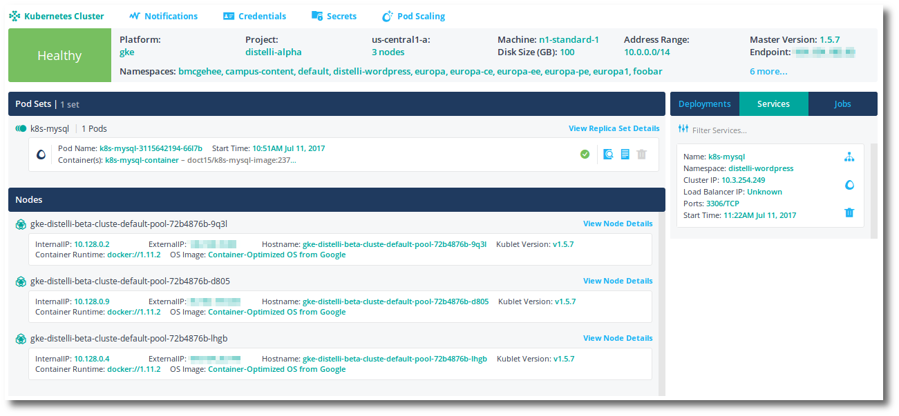

Here are some kubectl commands you can run to inspect the service.

~~~
distelli@serverA:~$ kubectl get services --namespace distelli-wordpress
NAME        CLUSTER-IP     EXTERNAL-IP   PORT(S)    AGE
k8s-mysql   10.3.242.243   <none>        3306/TCP   4m

distelli@serverA:~$ kubectl describe service k8s-mysql --namespace distelli-wordpress
Name:     k8s-mysql
Namespace:    distelli-wordpress
Labels:     <none>
Selector:   deployment=k8s-mysql
Type:     ClusterIP
IP:     10.3.242.243
Port:     default 3306/TCP
Endpoints:    10.0.3.191:3306
Session Affinity: None
No events.
~~~

If you do not have at least one endpoint, something is wrong. This could be the service can't find the deploy. Maybe in differing namespaces?

When another container is spun up in the same namespace as the k8s-mysql container and service, the following environment variables are available:

<h2>Add WordPress container to project</h2>

Now that the MySQL container and service are up and working, it is time to build and ultimately deploy the WordPress container.

<ol>
  <li>In your WordPress project, click <b>Add Containers</b>.</li>
  <li>Click <b>Connect Source Control</b> button.</li>
  <li>In the resulting Add Container dialog, click <b>Source Control</b> to select your source control.</li>
  <li>Next, click <b>Repository</b> to select your repository.</li>

  

  <li>Fill in the <b>Container Name</b> field with <b>k8s-wordpress-container</b>.</li>
  <li>Click <b>Cloud Provider</b> and select your docker registry provider.</li>
  <li>Finally, set the <b>Image</b> name to <b>YOUR_REGISTRY/k8s-wordpress-image</b>.</li>

  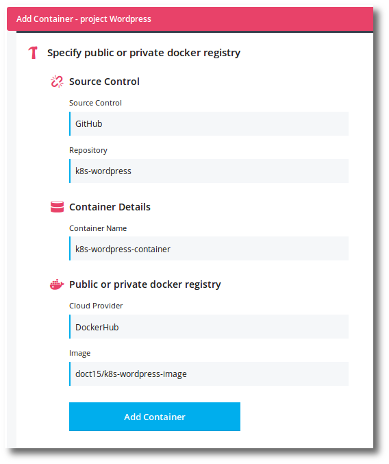

  <li>Click <b>Add Container</b>.</li>
</ol>

<h2>Build the WordPress container</h2>

Let's kick off a build to create the first k8s-wordpress image that you will be deployed to a Kubernetes 

<ol>
  <li>Click on the <b>Build Hammer</b> icon at the top right in your project.</li>
  <li>Select the <b>k8s-wordpress-container</b> container.</li>
  <li>Select your <b>Branch</b>. Typically this should be <b>master</b>.</li>
  <li>Click the <b>Build</b> button.</li>
</ol>

You <b>Go To Build!</b> to watch the live build logs. Wait until the build has completed successfully before continuing.

<h2>Add WordPress secrets</h2>

You will need to specify an environment variable to be used by the running WordPress container. This can be done through Kubernetes secrets. The environment variable being supplied is:

<ul>
  <li><b>WORDPRESS_DB_PASSWORD=password</b> - The password for WordPress to use to access the WordPress mysql database.</li>
</ul>

To create the secrets in Pipelines, do the following:

<ol>
  <li>From the cluster details page click <b>Secrets</b> near the top.</li>
  <li>Click <b>+ Add New Secret</b> link.</li>
  <li>Select the <b>Namespace</b> you created earlier <i>distelli-wordpress</i>.</li>
  <li>Give the secret a <b>Secret Name</b> of <i>k8s-wordpress-secret</i>.</li>
  <li>Add the secrets. This password must match the MYSQL_ROOT_PASSWORD specified earlier.</li>
</ol>

~~~
WORDPRESS_DB_PASSWORD=password
~~~

Click <b>Create Secret</b> button to finish.

<h2>Create WordPress persistent disk</h2>

To store information between container runs and updates, WordPress will need a persistent disk. The WordPress mount point will be mounted on the persistent disks.

~~~
gcloud compute disks create --size 200GB k8s-wordpress-disk --project YOUR_GCLOUD_PROJECT --zone YOUR_K8S_ZONE
~~~

<ol>
  <li>Execute the above command to create a 200GB persistent disk called k8s-wordpress-disk.</li>
</ol>

<h2>Deploy the WordPress container</h2>

Next we will deploy the container to the Kubernetes cluster.

<ol>
  <li>In Pipelines navigate to your <b>WordPress</b> project.</li>
  <li>Click the <b>Deploy</b> rocket icon near the top right.</li>
  <li>In the New Deployment select your <b>Cluster</b>.</li>
  <li>Select the <i>distelli-wordpress</i> <b>Namespace</b>.</li>
  <li>Click the <b>Deployment Name</b> field to <b>Create New Deployment</b> named <i>k8s-wordpress</i>.</li>
  <li>Enter a <b>Deployment Description</b> of <i>First deploy</i>.</li>
  <li>Click in the <b>Add Container(s)</b> field.</li>
  <li>You should see your k8s-wordpress-container that was just built. Click the <b>k8s-wordpress-container</b>.</li>
  <li>Click in the <b>Image Tag</b> field.</li>

  
If you built your image more than once, you may see more than one image tag.

  <li>Choose the most recent (top) image.</li>
  <li>Click <b>Add Container</b>.</li>

  <li>Click <b>Volumes</b> on the left.</li>
  <li>Click <b>Add Volume</b>.</li>
  <li>Enter the following Values:</li>

  <ul>
    <li><b>Volume Name</b> - k8s-wordpress-volume</li>
    <li><b>Volume Type</b> - gcePersistentDisk</li>
    <li><b>pdName</b> - k8s-wordpress-disk</li>
    <li><b>fsType</b> - Leave blank</li>
  </ul>

  <li>Click <b>Save Volume</b>.</li>
  <li>Click on the container <b>k8s-wordpress-container</b> on the left, to select it.</li>
  <li>Click on the tab labeled <b>Port Mappings</b>.</li>
  <li>Click the <b>Add Port Mapping</b> button.</li>
  <li>Set the Port Mapping values to the following:</li>

  <ul>
    <li><b>Name</b> - http</li>
    <li><b>Container Port</b> - 80</li>
    <li><b>Host Port</b> - 80</li>
    <li><b>Protocol</b> - TCP</li>
  </ul>

  <li>Click <b>Save Port Mapping</b>.</li>
  <li>Click on the <b>Volume Mounts</b> tab.</li>
  <li>Click <b>Add Volume Mount</b>.</li>
  <li>Enter the <b>Volume Mount</b> options as shown below:</li>

  <ul>
    <li><b>Volume</b> - k8s-wordpress-volume</li>
    <li><b>Mount Path</b> - /var/www/html</li>
    <li><b>Sub Path</b> - var/www/html</li>
    <li><b>Read Only</b> - false</li>
  </ul>

  <li>Click <b>Save Volume Mount</b>.</li>
  <li>Click <b>Environment Variables</b> tab.</li>
  <li>Click the <b>Add Variable</b> button.</li>
  <li>Enter the <b>Environment Variable</b> values as shown below:</li>

  <ul>
    <li><b>Environment Variable Name</b> - WORDPRESS_DB_PASSWORD</li>
    <li><b>Type of Variable</b> - (x) valueFrom -> secretKeyRef</li>
    <li><b>name</b> - k8s-wordpress-secret</li>
    <li><b>key</b> - WORDPRESS_DB_PASSWORD</li>
  </ul>

  <li>Click <b>Save Variable</b>.</li>
  <li>Click the <b>Add Variable</b> button to add another environment variable.</li>
  <li>Enter the <b>Environment Variable</b> values as shown below:</li>

  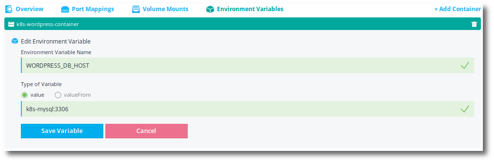

  <ul>
    <li><b>Environment Variable Name</b> - WORDPRESS_DB_HOST</li>
    <li><b>Type of Variable</b> - (x) value</li>
    <li><b>value</b> - k8s-mysql:3306</li>
  </ul>

  
The value supplied above are taking advantage of the kubernetes name service created for the k8s-mysql service you deployed. The DNS name <b>k8s-mysql</b> will resolve to the k8s-mysql service endpoints. This will allow WordPress to dynamically discover and connect to the database.

  
If the mysql container is restarted and receives a different endpoint IP, the kubernetes name service will dynamically update.

  
Note, the :3306 represents the mysql tcp port that WordPress should communicate on.

  <li>Click <b>Save Variable</b>.</li>
  <li>Click on <b>Overview</b> to see the container overview. Should look similar to below.</li>

  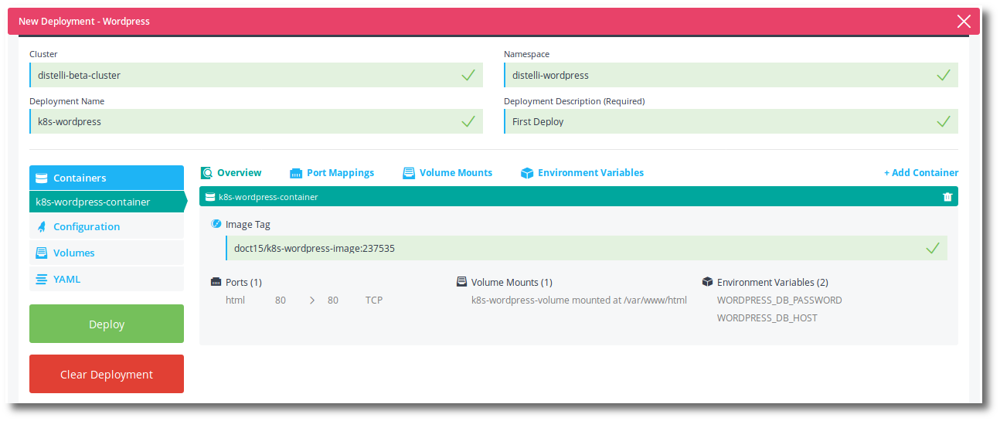

  <li>Click <b>Deploy</b> to initiate the deployment.</li>
</ol>

You can view the deployment details by clicking on the link <b>click here</b>.

<h2>Create WordPress service</h2>

A load balancer service will allow users to access the running WordPress container.

<ol>
  <li>Navigate to the <b>WordPress</b> project in Pipelines.</li>
  <li>Click the <b>Services</b> tab near the top.</li>
  <li>Select the <b>Cluster</b> where the k8s-wordpress container is deployed.</li>
  <li>Click the <b>Create a new service</b> button.</li>
  <li>Paste the following YAML into the <b>Create Service spec in YAML format</b> text area.</li>
</ol>

~~~
apiVersion: v1
kind: Service
metadata:
  name: k8s-wordpress
  namespace: distelli-wordpress
spec:
  selector:
    deployment: k8s-wordpress
  ports:
    - port: 80
      protocol: TCP
      targetPort: 80
  type: LoadBalancer
~~~

Click the <b>Create Service</b> button.

You can watch the service in the Pipelines cluster details page. When the load balancer service is ready, the <b>Load Balancer IP</b> will automatically be revealed. 

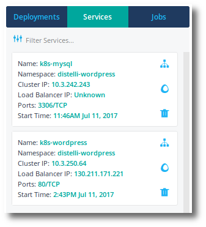

Once you have the Load Balancer IP, you can access the running WordPress container.

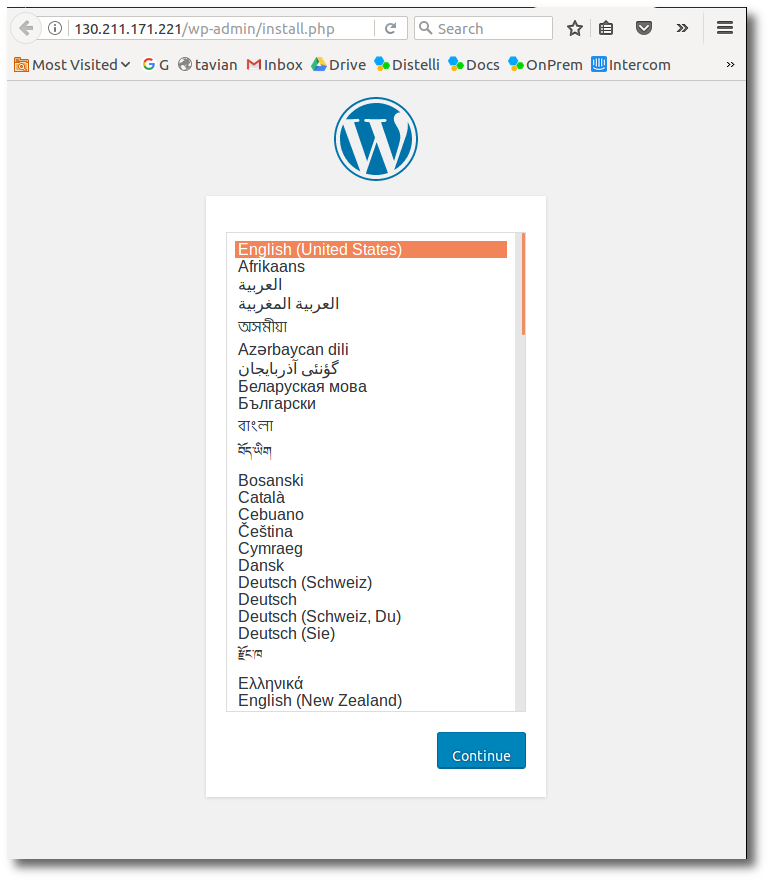

As long as you keep the persistent disks, this will continue to work across shutdowns and re-deploys.

