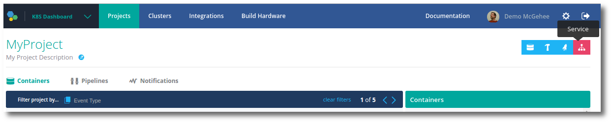
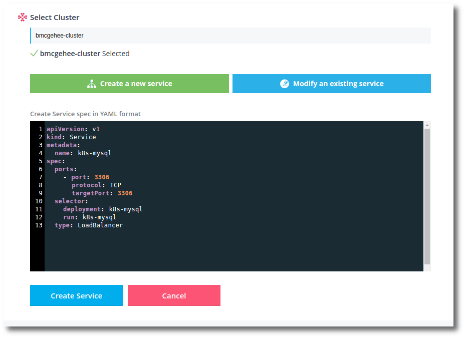

Pipelines uses Kubernetes service specifications in YAML format. You can use a service to expose container ports inside a cluster, or to create a Kubernetes load balancer. 

The following example shows the YAML service specification for a load balancer.

~~~
apiVersion: v1
kind: Service
metadata:
  name: k8s-mysql
spec:
  ports:
    - port: 3306
      protocol: TCP
      targetPort: 3306
  selector:
    deployment: k8s-mysql
    run: k8s-mysql
  type: LoadBalancer
~~~

> **Tip:** Before a Kubernetes service spec can be created, in Pipelines, the cluster and namespace where the service is to live must already exist in Pipelines.

<h3>Create service</h3>

1. Navigate to an existing <b>Project</b> in Pipelines. You can select any existing project, as deployments are not tied to a particular project.
1. In the top right, click the <b>Service</b> icon.
   
1. Select the <b>Cluster</b> you wish to create a service for.
1. Click <b>Create a new service</b> button.
1. Paste in your Kubernetes service specification <b>YAML</b>.
   
1. Click <b>Create Service</b> to finish.

This creates the service specification and configures the cluster with the service.

Services usually take a couple of minutes to provision in the cluster.

