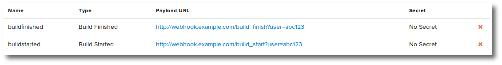
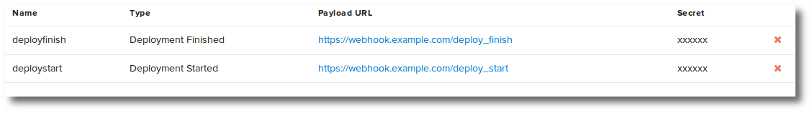
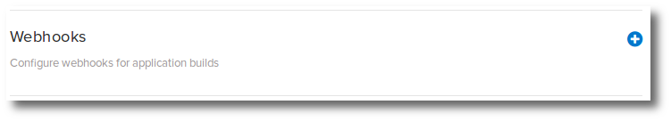
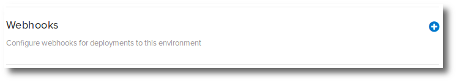
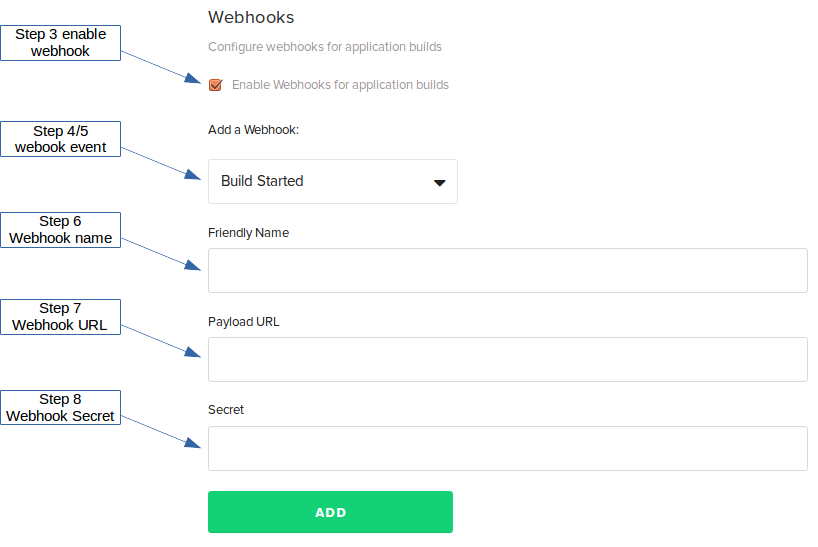

Webhooks provide a secure mechanism to make an HTTP POST based on a Puppet Pipelines event. The events that can trigger a webhook include:

<ul>
<li>Application Build Begins</li>
<li>Application Build Finishes</li>
<li>Environment Deploy Begins</li>
<li>Environment Deploy Finishes</li>
</ul>

Puppet Pipelines webhooks communicate with a webhook server in your environment. This means any firewall must allow Pipelines to reach your webhook server on port 80 and/or port 443 (or other TCP port you may configure for your webhook) and allow the return response from your webhook server to Puppet Pipelines.

## Create a webhook

There are two types of webhooks:

<ul>
<li><b>Application build webhooks</b> - Configured in application settings</li>
<li><b>Environment deploy webhooks</b> - Configured in environment settings</li>
</ul>

<ol>
<li>Navigate to the <b>application settings (builds)</b> or <b>environment settings (deploys)</b>.</li>
<li>Expand the <b>Webhooks</b> section.</li>

<li>Ensure the <b>Enable Webhooks ...</b> checkbox is checked.</li>
<li>Click the Add a Webhook <b>Type</b> drop down.</li>
<li>Select the event you wish to receive a webhook for.</li>

<li>Enter a unique <b>Friendly Name</b> for the webhook. Friendly names may not contain spaces or special characters.</li>

<li>Enter a webhook URL.</li>

Some example webhook URLs include:

<ul>
<li>http://192.0.2.25</li>
<li>https://192.0.2.25</li>
<li>http://webhook.example.com/build_started</li>
<li>http://webhook.example.com:8080</li>
<li>https://hook2.example.com:8443?userid=abc123&task=build_start</li>
</ul>

<li>Enter a secret, if the host requires one.</li>

A webhook secret is configured on the webhook server and the webhook client (Puppet Pipelines), and must match for webhooks to be accepted by the webhook server. Not all webhook servers are configured with a secret. Talk to your webhook server administrator to determine if a secret is required.

</ol>

## Webhook body

Each webhook contains a JSON-formatted body of information regarding the event that occured.

<h4>Build Started</h4>

~~~
{
    api_url:https://www.distelli.com/jdoe/builds/6982
    app_name:rubyubunturbenvapp
    build_num:6982
    build_server:null
    commit:
    Object: {
        branch:master
        commit_id:2670a8bf48bbc326833b24854c6559b82577a832
        committer:doct15
        date:null
        msg:Update distelli-manifest.yml
        repo_name:rubyubunturbenvapp
        repo_owner:doct15
        url:https://github.com/doct15/rubyubunturbenvapp/commit/2670a8bf48bbc326833b24854c6559b82577a832
    }
    create_time:2015-11-20T23:43:01Z
    dependencies:null
    deployments:null
    end_time:null
    html_url:https://www.distelli.com/jdoe/builds/6982
    release_url:null
    release_version:null
    start_time:null
    status:Queued
}
~~~

<h4>Build Finished</h4>

~~~
{
    api_url:https://www.distelli.com/jdoe/builds/6982
    app_name:rubyubunturbenvapp
    build_num:6982
    build_server:null
    commit:
    Object: {
        branch:master
        commit_id:2670a8bf48bbc326833b24854c6559b82577a832
        committer:doct15
        date:null
        msg:Update distelli-manifest.yml
        repo_name:rubyubunturbenvapp
        repo_owner:doct15
        url:https://github.com/doct15/rubyubunturbenvapp/commit/2670a8bf48bbc326833b24854c6559b82577a832
    }
    create_time:2015-11-20T23:43:01Z
    dependencies:null
    deployments:Array: []
    end_time:2015-11-20T23:43:90Z
    html_url:https://www.distelli.com/jdoe/builds/6982
    release_url:https://www.distelli.com/jdoe/apps/rubyubunturbenvapp/releases/v54
    release_version:v54
    start_time:2015-11-20T23:43:10Z
    status:Success
}
~~~

<h4>Deploy Started</h4>

~~~
{
    api_url:https://www.distelli.com/jdoe/deployments/44933
    app_name:RubyUbuntuRbenvApp
    app_url:https://www.distelli.com/jdoe/apps/RubyUbuntuRbenvApp
    deployer:jdoe
    deployment_id:d-gigh44erc1db875a98d
    deployment_number:44933
    deployment_state:InProgress
    deployment_time:2015-11-19T01:37:63Z
    deployment_type:Deploy
    env_name:rubyubunturbenvapp-beta
    env_url:https://www.distelli.com/jdoe/envs/rubyubunturbenvapp-beta
    html_url:https://www.distelli.com/jdoe/deployments/44933
    release_url:https://www.distelli.com/jdoe/apps/RubyUbuntuRbenvApp/releases/v53
    release_version:v53
    servers:
    Object: {
        done:0
        failed:0
        in_progress:0
        pending:0
        waiting:1
    }
    servers_url:https://www.distelli.com/jdoe/deployments/d-gigh44erc1db875a98d/servers
    stagger_delay:60
    stagger_size:1
}

~~~

<h4>Deploy Finished</h4>

~~~
{
    api_url:https://www.distelli.com/jdoe/deployments/44933
    app_name:RubyUbuntuRbenvApp
    app_url:https://www.distelli.com/jdoe/apps/RubyUbuntuRbenvApp
    deployer:jdoe
    deployment_id:d-gigh44erc1db875a98d
    deployment_number:44933
    deployment_state:Failed
    deployment_time:2015-11-19T01:37:63Z
    deployment_type:Deploy
    env_name:rubyubunturbenvapp-beta
    env_url:https://www.distelli.com/jdoe/envs/rubyubunturbenvapp-beta
    html_url:https://www.distelli.com/jdoe/deployments/44933
    release_url:https://www.distelli.com/jdoe/apps/RubyUbuntuRbenvApp/releases/v53
    release_version:v53
    servers:
    Object: {
        done:0
        failed:1
        in_progress:0
        pending:0
        waiting:0
    }
    servers_url:https://www.distelli.com/jdoe/deployments/d-gigh44erc1db875a98d/servers
    stagger_delay:60
    stagger_size:1
}
~~~

