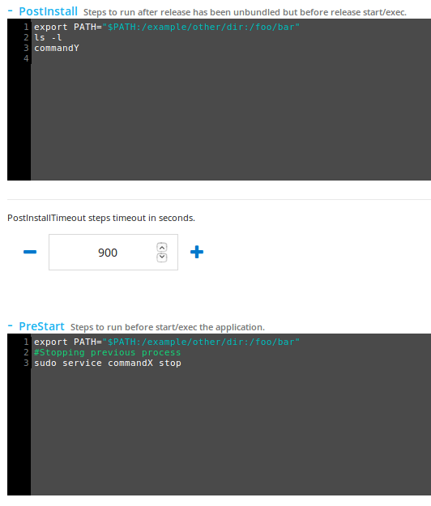

## build

<h3>build</h3>

Begin a build task on the local system. This will run the build steps of the manifest on the local machine in the current directory.

<h4>SYNTAX</h4>

~~~
distelli build -app <domain>/<app-name> -branch <branch-name> -clone <git|hg>:<clone uri> -dind|-nodind -manifest <yaml-file> -rev <commit-id> -message <msg> -profile-dir <dir> -rev <commit-id> -taskid <taskDomain>:<taskNum> -vm <vagrant|docker>:<id>
~~~

<h4>OPTIONS</h4>

~~~
-app <domain>/<app-name>
~~~

Validate that the manifest(s) match this application name. May be specified multiple times (or separate app names with a comma).

~~~
-branch <branch-name>
~~~

Specify a specific branch for the repository to be cloned.

~~~
-clone <git|hg>:<clone uri>
~~~

Clone the repository before performing the build. If this repository is connected to your Puppet Pipelines account, the credentials for this account are downloaded.

~~~
-dind|-nodind
~~~

By default, Docker-In-Docker is run in a separate container for builds. Add `-nodind` to disable this behavior

~~~
-manifest <yaml-file>
~~~

Specify an alternative manifest (defaults to ./distelli-manifest.yml if it exists). This may be a comma-separated list of manifests, or you can supply this argument multiple times. 

> **Note:** If the manifest is not in the root directory of your repository, then the `distelli push` command will be run with a working directory of the manifest.

~~~
-message <msg>
~~~

A message that will be associated with the build artifact created from this build.

~~~
-profile-dir <dir>
~~~

Location of profile information (like cached credentials), defaults to <b>~</b>.

~~~
-rev <commit-id>
~~~

Specify a specific commit (or revision) of the repository to checkout.

~~~
-taskid <taskDomain>:<taskNum>
~~~

Register the build artifacts with the specified task (which must be in-progress).

~~~
-vm <vagrant|docker>:<id>
~~~

After cloning, launch the build commands within the specified virtual machine. If 'vagrant' is specified, this is the name of the Vagrant "box", otherwise it is the name of the Docker image.

<h4>USAGE</h4>

By default, with no options, this command will look in the local ./distelli-manifest.yml file at the [Build sections](https://puppet.com/docs/pipelines-for-apps/manifest-build.html) and run those steps. Then the artifacts will be [bundled and pushed](./cli-command.html).

~~~
distelli build
~~~

<h4>EXAMPLES</h4>

Doing a basic build

~~~
distelli build
~~~

## bundle

Locally bundle a release of an application.

<h4>SYNTAX</h4>

~~~
distelli bundle [-full] [-manifest <manifest-filename>] [-output-file <filename>] [-profile-dir <dir>] [-quiet]
~~~

<h4>OPTIONS</h4>

~~~
-full
~~~

Dislplay even more information (like the manifest data uploaded with the release).

~~~
-manifest <manifest-filename>
~~~

The manifest file to use. Defaults to <b>distelli-manifest.yml</b>.

~~~
-output-file <output-filename>
~~~

Location to put the bundle.

~~~
-quiet
~~~

Disable the progress bar.

<h4>USAGE</h4>

By default, with no options, this command will look in the local ./distelli-manifest.yml file at the PkgInclude and PkgExclude section to determine which files, if any, will be bundled. If these sections are omitted, nothing will be bundled.

These files will be tar'd and gzip'd and saved locally to ./.distelli/pkgbuild with the following naming convention:

~~~
APPNAME-YYYY-MM-DD-HH-MM-SS-MD5SUM.tar.gz
~~~

<ul>
<li>APPNAME - The Pipelines application name</li>

<li>YYYY - The full year</li>

<li>MM - The month</li>

<li>DD - The date</li>

<li>HH - The hour</li>

<li>MM - The minute</li>

<li>SS - The second</li>

<li>MD5SUM - The MD5 checksum of the files contents</li>

<li>tar - The files are tar'd</li>

<li>gz - The file is compressed using gzip</li>
</ul>

<h4>EXAMPLES</h4>

Doing a basic bundle

~~~
$ distelli bundle

Packaging App: SimpleApp
Packaged 2 files in 2 directories

Packaged: ./.distelli/pkgbuild/SimpleApp-2015-07-02-00-21-57-d01fdbcbfca218764a037ecfdab75620.tar.gz
~~~

Bundling to a different filename while using a different manifest.

~~~
$ distelli bundle -o Simpleapp.tar.gz -f linux-manifest.yml

Packaging App: SimpleApp
Packaged 2 files in 2 directories

Packaged: Simpleapp.tar.gz
~~~

<h4>Bundle storage</h4>

By default the release bundle is stored in your Pipelines account in the cloud. If you prefer to store your release bundle in your AWS S3 bucket, you can do so. 

## create

Create a new application in a Pipelines account.

<h4>SYNTAX</h4>

~~~
distelli create <username>/<appname>
~~~

<h4>OPTIONS</h4>

None.

<h4>USAGE</h4>

Creating an application with `distelli create` will create an empty application in a Pipelines account.

<h4>EXAMPLES</h4>

Creating an application called "SimpleApp" in account "jdoe".

~~~
$ distelli create jdoe/SimpleApp
Creating App: jdoe/SimpleApp
App jdoe/SimpleApp created successfully
~~~

## deploy

Deploy an application release to an environment.
You can either push and deploy a local release or deploy an existing release.

<h4>SYNTAX</h4>

~~~
distelli deploy -e|--env <environment> [-d|--stagger-delay <stagger-delay>] [-f|--manifest <manifest-filename>] [-m|--description <description>] [-q|--quiet] [-r|--release <release-version>] [-s|--<stagger-size>] [-y|--yes]
~~~

<h4>OPTIONS</h4>

> **Important:** The `-h | --hosts` option has been deprecated. If you need to deploy to a single server, create an environment with only that server in the environment.

> **Note:** The `-e | --env` option is required.

~~~
-e|--env <environment>
~~~

The name of the application environment you want to deploy to. This option must be specified when using the `distelli deploy` command.

~~~
-d|--stagger-delay <stagger-delay>
~~~

This option specifies the stagger delay for the deploy. The stagger delay is the time in seconds to wait between stagger sets when deploying to multiple servers in an environment. If this option is omitted, the stagger delay defaults to 60 seconds.

~~~
-f|--manifest <manifest-filename>
~~~

With this option the deploy will use an alternate manifest. If this option is omitted the deploy uses the local ./distelli-manifest.yml.

~~~
-m|--description <description>
~~~

Provide a description for this deploy.

~~~
-q|--quiet
~~~

This option indicates that the CLI should not monitor the deployment and exit immediately after starting the deployment.

~~~
-r|--release <release-version>
~~~

This option will instruct the deploy to use a specific existing application release. For more information on release ID's see Pipelines for Applications: [Finding a Release ID](https://puppet.com/docs/pipelines-for-apps/team/release.html).

~~~
-s|--stagger-size <stagger-size>
~~~

This option specifies the stagger size for the deploy. The stagger size is the number of servers to deploy to at a time, when deploying to multiple servers in an environment. If this option is omitted, the stagger size defaults to 10 servers.

~~~
-y|--yes
~~~

This option indicates that the CLI should not ask for confirmation, and should start the deployment immediately.

<h4>USAGE</h4>

With no options besides the required `-e` <environment> the deploy command will look for a local ./distelli-manifest.yml and based on the information in the manifest, [bundle](#bundle) a release and [push](#push) it. The deploy will then coordinate with the Pipelines SaaS to deploy this release to the specified <environment>.

<h4>EXAMPLES</h4>

Deploy the current local application, in the current directory, to the environment "SA_Linux."

~~~
$ distelli deploy -e SA_Linux

Starting deployment of jdoe/SimpleApp
to 1 Environment(s):

jdoe/SA_Linux: 2 server(s)

Release: New Release
Stagger Size: 10
Stagger Delay: 60

Ready to start Deployment

Are you sure? (Yes/NO): Yes
Starting Deployments...
Packaged 2 files in 2 directories
Pushing App: SimpleApp
Uploading Bundle: [==========] 100%

Creating Release... DONE
Deploying jdoe/SimpleApp to env: jdoe/SA_Linux

https://myaccount.distelli.com/deployment/29948
Deployment 29948 InProgress: [=         ] Servers: 0 Done, 0 In Progress, 0
Deployment 29948 InProgress: [ =        ] Servers: 0 Done, 0 In Progress, 0
Deployment 29948 Done: [=         ] Servers: 1 Done, 0 In Progress, 0 Failed

Deployment 29948 completed Successfully
See https://myaccount.distelli.com/deployment/29948
~~~

Deploy application release version "v50" to environment "SA_Linux" and skip the CLI confirmation, answering "Yes".

~~~
$ distelli deploy -r v50 -e SA_Linux -y

Starting deployment of jdoe/SimpleApp
to 1 Environment(s):

jdoe/SA_Linux: 1 server(s)

Release: v50
Stagger Size: 10
Stagger Delay: 60

Starting Deployments...

https://myaccount.distelli.com/deployment/29952
Deployment 29952 InProgress: [=         ] Servers: 0 Done, 0 In Progress, 0
Deployment 29952 InProgress: [ =        ] Servers: 0 Done, 0 In Progress, 0
Deployment 29952 Done: [=         ] Servers: 1 Done, 0 In Progress, 0 Failed

Deployment 29952 completed Successfully
See https://myaccount.distelli.com/deployment/29952
~~~

Deploy the current local application, in the current directory, to the environment "SA_Linux" and suppress CLI monitoring.

~~~
$ distelli deploy -e SA_Linux -q -y

Starting deployment of jdoe/SimpleApp
to 1 Environment(s):

jdoe/SA_Linux: 1 server(s)

Release: New Release
Stagger Size: 10
Stagger Delay: 60

Starting Deployments...
Packaged 1 files in 1 directories
Pushing App: SimpleApp
Uploading Bundle: [==========] 100%

Creating Release... DONE
Deploying jdoe/SimpleApp to env: jdoe/SA_Linux

Deployment 29985: Started
See https://myaccount.distelli.com/deployment/29985
~~~

### Deploy PATH

When doing deploys, the Pipelines agent uses the following command to retrieve its PATH.

~~~
getconf PATH
~~~

Which will result in a PATH of:

~~~
/bin:/usr/bin
~~~

<h2>Extending agent deploy PATH</h2>

You can update the PATH during deploys by using the Env: section of the [Pipelines manifest](https://puppet.com/docs/pipelines-for-apps/manifest.html). The Env: section of the manifest allows you to provide environment variables used during every phase of the deploy. Here is an example:

~~~
Env:
  - 'PATH="$PATH:/example/other/dir:/foo/bar"'
~~~

If you are using the in-application manifest instead of a distelli-manifest.yml, the Env: manifest section is not available.

> **Note:** Using an in-repository distelli-manifest.yml is strongly recommended.

In this scenario you would have to update the PATH in every manifest step the PATH is needed.

~~~
export PATH="$PATH:/example/other/dir:/foo/bar"
~~~

## help

Shows the CLI help.

<h4>SYNTAX</h4>

~~~
distelli help [<command>]
~~~

<h4>OPTIONS</h4>

~~~
<command>
~~~

Any Pipelines <b>command</b> you wish to receive more help for.

<h4>USAGE</h4>

Simply issuing a `distelli help` will provide a list of commands. Doing a `distelli help <command>` will provide more help on that specific command.

<h4>EXAMPLES</h4>

Get help.

~~~
$ distelli help
Usage: distelli <command>

Distelli ToolKit

  bundle
    Locally create a new release of an application

  create <username>/<app-name>
    Create a new application

  version
    Display the version of distelli in use

  login
    Login to your distelli account

  agent
    Connect your server to Distelli

  push
    Push a new release of an application

  deploy
    Deploy a release to an environment

  build
    Run a build

~~~

Get help with the `login` command.

~~~
$ distelli help login
Usage: distelli login -profile-dir <dir>

Login to your distelli account

  -profile-dir <dir>
    Location of profile information (like cached credentials), defaults to
    /home/jdoe
~~~

## login

Login (sign in) to your Puppet Pipelines account.

<h4>SYNTAX</h4>

~~~
distelli login  [-conf FILE]
~~~

<h4>OPTIONS</h4>

~~~
-conf FILE
~~~

This option tells the agent to read a distelli.yml for the agent access token and secret key. See the [Pipelines distelli.yml Usage](./distelliyml.html) for more information.

<h4>USAGE</h4>

Use the `distelli login` command to connect the Pipelines CLI to your Puppet Pipelines account. You will be prompted for your email and password.

<h4>EXAMPLES</h4>

~~~
$ distelli login

Email: jdoe@example.com
Password:
~~~

> **Important:** If you enter your account password incorrectly too many times, a `Failed to login to your Distelli Account, Please check your credentials` message will appear, and your account will be locked as a security precaution. The lock expires in two hours. 
## push

Bundle a release of your application and push it to a Puppet Pipelines account.

> **Important:** If you have configured an S3 bucket in Pipelines, a bundle of the application release will be pushed to your S3 bucket.

<h4>SYNTAX</h4>

~~~
distelli push  [-description <message>] [-release-notes] [-manifest <manifest-filename>] [-save-release <filename>] [-quiet]
~~~

<h4>OPTIONS</h4>

~~~
-description <description>
~~~

Provides a message for this release.

~~~
-release-notes
~~~

This option will prompt the user for a multi-line input of text that will be used as the "release notes" in the web UI. For more information see [Viewing Release Notes](https://puppet.com/docs/pipelines-for-apps/release.html).

~~~
-manifest <manifest-filename>
~~~

This option will use the specified manifest file when bundling and pushing the release. If this option is not supplied, the CLI uses distelli-manifest.yml in the current directory.

~~~
-save-release <filename>
~~~

Save the release identifier to this filename.

~~~
-quiet
~~~

Disable the progress bar

<h4>USAGE</h4>

Use the `distelli push` command to bundle and upload your release for potential future deployments. During a push, the distelli-manifest.yml [PreRelease](https://puppet.com/docs/pipelines-for-apps/team/manifest-build.html) section is executed.

<h4>EXAMPLES</h4>

Push the current local directory application up to your Puppet Pipelines account which has an S3 bucket configured. Also include a message "First Release".

~~~
$ distelli push -m "First Release"
    Packaged 1 files in 1 directories
    Pushing App: SimpleApp
    Uploading Bundle to S3: [==========] 100%
    Creating Release... DONE
~~~

Push the local directory application up to your Puppet Pipelines account with a release note.

~~~
distelli push -r
Enter Release Notes (Ctrl-D to Finish):

This release fixes issues found in the following bugs:
* Bug #4373
* Bug #4201
* Bug #3293

    Packaged 1 files in 1 directories
    Pushing App: SimpleApp
    Uploading Bundle: [=========] 100%

    Creating Release... DONE
    Uploading Release Notes... DONE
~~~

## version

Display what version of the unified CLI agent you have installed.

<h4>SYNTAX</h4>

~~~
distelli version
~~~

<h4>OPTIONS</h4>

There are no options.

<h4>USAGE</h4>

Use the `distelli version` command display the verison of the CLI you have installed.

<h4>EXAMPLES</h4>

~~~
$ distelli version
Distelli ToolKit 3.59 (+9 72e46b4f200e)
Copyright (C) 2015 Distelli Inc.
~~~

