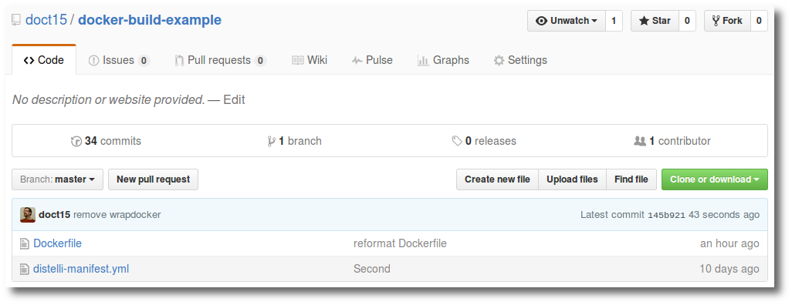
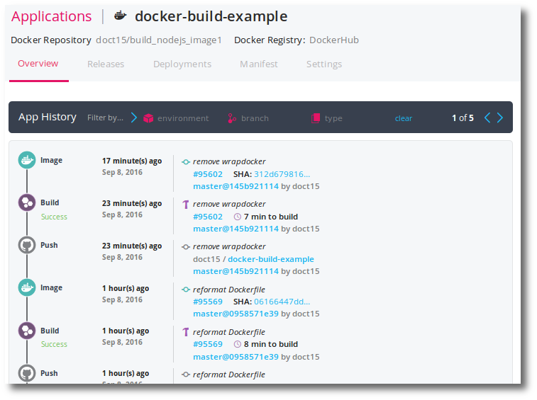
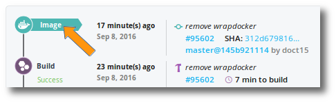
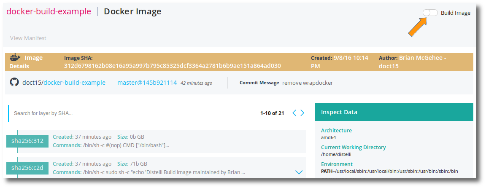
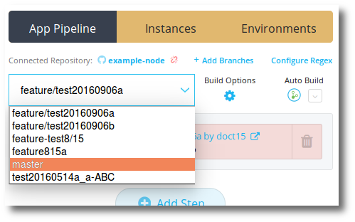
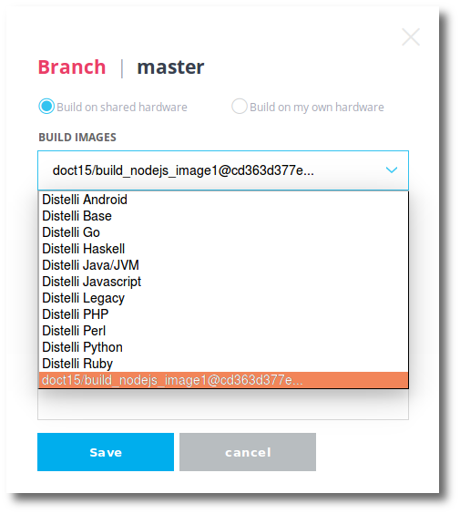

With Pipelines for Applications builds you can build on one of the many existing Pipelines shared build images. These images include:

<ul>
  <li>Pipelines Android</li>
  <li>Pipelines Base</li>
  <li>Pipelines Go</li>
  <li>Pipelines Haskell</li>
  <li>Pipelines Java/JVM</li>
  <li>Pipelines Javascript</li>
  <li>Pipelines Legacy</li>
  <li>Pipelines PHP</li>
  <li>Pipelines Perl</li>
  <li>Pipelines Python</li>
  <li>Pipelines Ruby</li>
</ul>

For more information on these build images, see [Pipelines Build Environments](./build-environment.html). 

> **Important:** The Pipelines build servers use [the IP addresses housed in this GitHub repostory](https://github.com/puppetlabs/pipelines-ips). 
>
> If your organization requires a whitelist of IP adresses, such as for a firewall, we strongly recommend watching this repository for changes. 
>
> If whitelisting IP addresses isn't an option, see our documentation on [setting up your own build servers](./build-hardware.html#use-your-own-build-server). 

You can further enhance this list with your own custom-built Docker images. To add a custom-built image to the shared image list, you create a Docker Dockerfile and build it with Pipelines for Applications. Simply navigate to the completed Docker image details page in the Pipelines web UI and mark that image as a build image.

## Image requirements

<ul>
  <li>The Docker image should be based on a flavor of Linux.</li>
  <li>The Docker image should have the following tools installed:</li>
  <ul>
    <li><b>/bin/sh</b> - Specifically, this must work: <code>docker run /bin/sh</code></li>
    <li><b>bash on PATH</b> - If not, Pipelines will attempt to install it.</li>
    <li><b>curl on PATH</b> - If not, Pipelines will attempt to install it.</li>
    <li><b>gosu on PATH</b> - If not, Pipelines will attempt to install it.</li>
    <li><b>useradd on PATH</b> - If not, Pipelines will attempt to install it.</li>
    <li><b>distelli on PATH</b> - If not, Pipelines will attempt to install it.</li>
    <li><b>sudo on PATH</b> - If not, Pipelines will attempt to install it.</li>
  </ul>
</ul>

## Example Dockerfile

The following Dockerfile exemplifies creating a Docker image for building nodejs applications in Docker. Please note the comments inline.

~~~
# Ubuntu has the necessary framework to start from
FROM ubuntu:14.04

# Run as root
USER root

# Create Distelli user
RUN useradd -ms /bin/bash distelli 

# Set /home/distelli as the working directory
WORKDIR /home/distelli
    
# Install prerequisites. This provides me with the essential tools for building with.
# Note. You don't need git or mercurial.
RUN sudo apt-get update -y \
    && sudo apt-get -y install build-essential checkinstall git mercurial \
    && sudo apt-get -y install libssl-dev openssh-client openssh-server \
    && sudo apt-get -y install curl apt-transport-https ca-certificates

# Update the .ssh/known_hosts file:
RUN sudo sh -c "ssh-keyscan -H github.com bitbucket.org >> /etc/ssh/ssh_known_hosts"

# Install Distelli CLI to coordinate the build in the container
RUN curl -sSL https://pipelines.puppet.com/download/client | sh 

# Install Docker
# Note. This is only necessary if you plan on building Docker images
RUN sudo apt-key adv --keyserver hkp://p80.pool.sks-keyservers.net:80 --recv-keys 58118E89F3A912897C070ADBF76221572C52609D \
    && sudo sh -c "echo 'deb https://apt.dockerproject.org/repo ubuntu-trusty main' > /etc/apt/sources.list.d/docker.list" \
    && sudo apt-get update -y \
    && sudo apt-get purge -y lxc-docker \
    && sudo apt-get -y install docker-engine \
    && sudo sh -c 'curl -L https://github.com/docker/compose/releases/download/1.6.2/docker-compose-`uname -s`-`uname -m` > /usr/local/bin/docker-compose' \
    && sudo chmod +x /usr/local/bin/docker-compose \
    && sudo docker -v

# Setup a volume for writing Docker layers/images
VOLUME /var/lib/docker

# Install gosu
ENV GOSU_VERSION 1.9
RUN sudo curl -o /bin/gosu -sSL "https://github.com/tianon/gosu/releases/download/1.9/gosu-$(dpkg --print-architecture)" \
     && sudo chmod +x /bin/gosu

# Install node version manager as distelli user
USER distelli
RUN curl -o- https://raw.githubusercontent.com/creationix/nvm/v0.31.0/install.sh | bash 

# Ensure the final USER statement is "USER root"
USER root

# An informative file I like to put on my shared images
RUN sudo sh -c "echo 'Distelli Build Image maintained by Brian McGehee bmcgehee@distelli.com' >> /distelli_build_image.info"

# The following entry point is not necessary
CMD ["/bin/bash"]
~~~

## Create application

You will need to create an application for creating your custom build image. This application will be created in a software repository and added to Pipelines as an application.

1. Create a new repository with the above Dockerfile in it.
1. Add the following distelli-manifest.yml to this repository.

~~~
DISTELLI_USERNAME/APP_NAME:

  Build:
    - echo "--Creating Docker Image--"
    - docker login -u "$DISTELLI_DOCKER_USERNAME" -p "$DISTELLI_DOCKER_PW" $DISTELLI_DOCKER_ENDPOINT
    - docker build --quiet=false -t "$DISTELLI_DOCKER_REPO" "$DISTELLI_DOCKER_PATH"
    - docker tag "$DISTELLI_DOCKER_REPO" "$DISTELLI_DOCKER_REPO:$DISTELLI_BUILDNUM" 
    - echo "--Pushing Docker Image--"
    - docker push "$DISTELLI_DOCKER_REPO:$DISTELLI_BUILDNUM"
~~~

1. Replace the following fields:

<ul>
  <li><b>DISTELLI_USERNAME</b> - Your Pipelines username.</li>
  <li><b>APP_NAME</b> - The name of the repository or app name in Pipeines for Applications.</li>
</ul>

You can fork my repository at [https://github.com/doct15/docker-build-example](https://github.com/doct15/docker-build-example).

1. Add this repository to a new Pipelines application. For more info on creating applications, see [Creating and Building an Application](https://puppet.com/docs/pipelines-for-apps/team/application-create.html).

    While creating your new application, ensure you configure a Docker registry to store your build image. For more info see [Enabling Docker for New Applications](https://puppet.com/docs/pipelines-for-apps/team/docker.html) or see [Enabling Docker for Existing Applications](https://puppet.com/docs/pipelines-for-apps/team/docker.html).

The above image shows my example application. Each of my successful builds creates a Docker image that is placed in the Docker repository.

<h2>Set Build Image</h2>

After a successful build of the Docker container, there will be an <b>Image</b> event in Pipelines. Clicking on this will take you to the image details page.

In the image details page, click the <b>Build Image</b> switch at the top right.

You are now ready to use your new custom build image to build Pipelines applications.

## Using custom Docker images to build in Pipelines

Any Pipelines application that wishes to build with this new custom Docker build image can do so. This option is branch-specific.

1. Navigate to the **application** in the Pipelines web UI.
1. Select the **branch** you wish to build with the custom Docker image.

1. Click the **Build Options** gear.

You can now select to build in your custom container.

