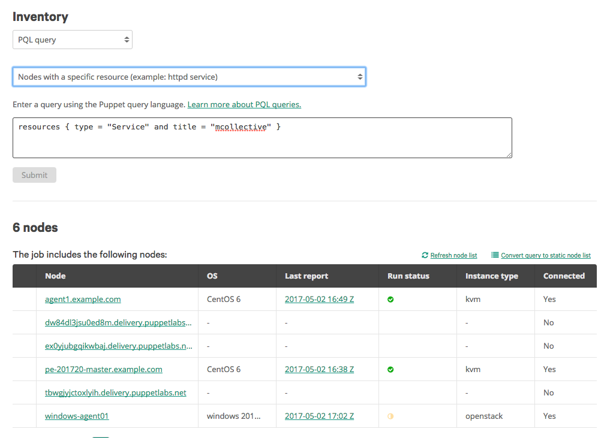

# Decommissioned nodes causing orchestration job failure in the console in Puppet Enterprise 2017.2.1

I entered a PQL query in the PE console so that I can target specific nodes for an orchestrator job. Decommissioned nodes are showing up in the node list, and when I run the job, it fails on those nodes. How do I remove the decommissioned nodes from the job?

<h3 id="error-messages">Error messages</h3>

When the job runs, it fails on all decommissioned nodes, and you get a <code>job finished with failure</code> error.

<h3 id="version-and-installation-information">Version and installation information</h3>

<strong>PE version:</strong> 2017.2.1  <strong>OS:</strong> Any <strong>Installation type:</strong> Any

<h3 id="solution">Solution</h3>

Orchestrator queries don’t automatically differentiate between active and decommissioned nodes.

<ol>
<li>

Remove decommissioned nodes from the list of nodes in your orchestrator job by adding <code>nodes[certname] {</code> and <code>and deactivated is null }</code> to your PQL query.

For example:

<ul>
<li>

<code>nodes[certname] { resources { type = "Service" and title = "puppet" } and deactivated is null }</code>

</li>
<li>

<code>nodes[certname] { inventory { facts.os.name = "CentOS" } and deactivated is null }</code>

</li>
<li>

<code>nodes[certname] { reports { latest_report? = true and status = "failed" } and deactivated is null }</code>

</li>
</ul>
</li>
</ol>
