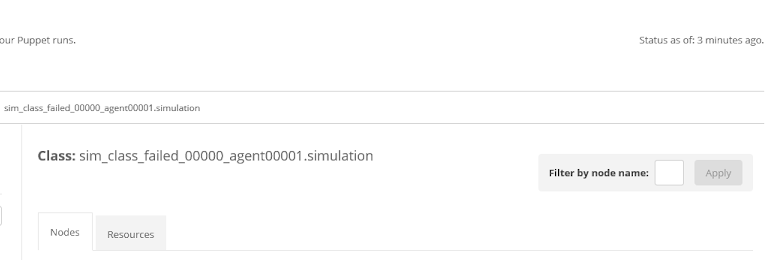

# Puppet Enterprise console Events page displays "Filter by node name:" field incorrectly in Internet Explorer 11

In Internet Explorer 11, in the console <strong>Events</strong> page, the <strong>Filter by node name:</strong> field is not displaying correctly. It is on the right side of the page and very small.

<h3 id="version-and-installation-information">Version and installation information</h3>

<strong>PE version:</strong> All supported versions  <strong>OS:</strong> Windows

<h3 id="solution">Solution</h3>

This issue occurs in Internet Explorer version 11.0.9600. It does not occur in versions 11.0.14393.0 or higher.

Fix the issue by upgrading Internet Explorer 11 to the latest available version.

