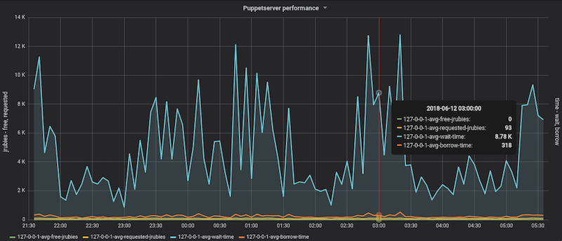
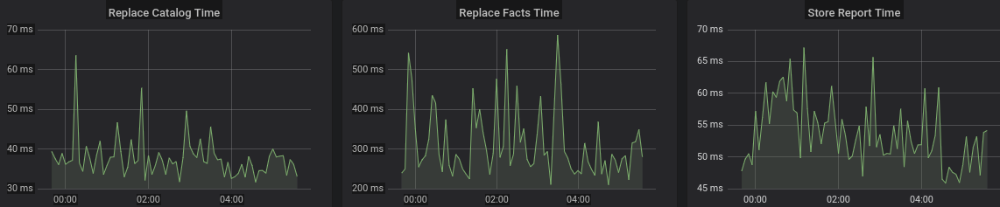
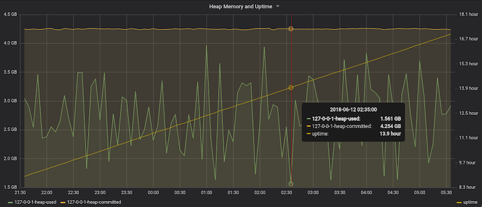

# Manage the installation and configuration of metrics dashboards using the puppetlabs-puppet_metrics_dashboard module for Puppet Enterprise 2016.4 to 2019.1

Configure Grafana, Telegraf, and InfluxDB to use metrics from Puppet’s services using Site Reliability Engineer Erik Hansen’s <a href="https://forge.puppet.com/modules/puppetlabs/puppet_metrics_dashboard" rel="noreferrer"><code>puppetlabs-puppet_metrics_dashboard</code></a> module. You can then view Puppet Server performance, heap memory and uptime, and submission time for catalogs, facts, and reports to PuppetDB, and more.

<strong>PE version:</strong> 2016.4 to 2019.1

<h3>Solution</h3>

Use the module to get metrics using any or all of these methods:

<ul>
<li>Use archive files from the <a href="https://forge.puppet.com/modules/puppetlabs/puppet_metrics_collector"><code>puppetlabs-puppet_metrics_collector</code></a> module</li>
<li>Use Puppet Server's built-in graphite support</li>
<li>Use Telegraf to poll Puppet's metrics endpoints</li>
</ul>

<a href="https://forge.puppet.com/modules/puppetlabs/puppet_metrics_dashboard" rel="noreferrer">Get the module</a>

<a href="https://puppet.com/blog/monitor-puppet-infrastructure-puppet-metrics-dashboard-module">Learn more about the puppetlabs-puppet_metrics_dashboard module from our blog</a>.

