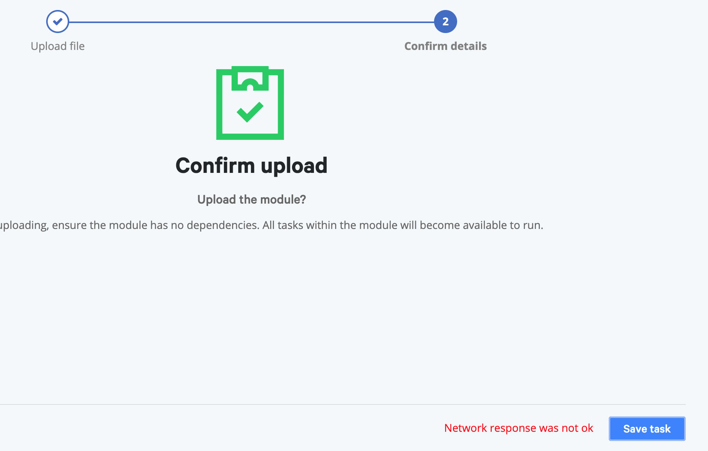

# "Network response was not okay" error when uploading a module in Puppet Remediate 1.0.1

When I click the <strong>Save task</strong> button to upload a new module in Puppet Remediate, I get a <code>Network response was not ok</code> error.

<h3 id="error-messages">Error messages</h3>

You are getting this error because a module with the same name was already uploaded.

<figure></figure>
<h3 id="version-and-installation-information">Version and installation information</h3>

<strong>Product:</strong> Puppet Remediate  <strong>Version:</strong> 1.0.1

<h3 id="solution">Solution</h3>

To install a different version of this module, you must delete all tasks associated with the version that’s already installed.

In the sidebar, click <strong>Manage tasks</strong>. Under <strong>Tasks</strong>, select all tasks in the module you’d like to update. To the right of <strong>Task</strong>, click <strong>Action</strong>, and then select <strong>Remove</strong>.

